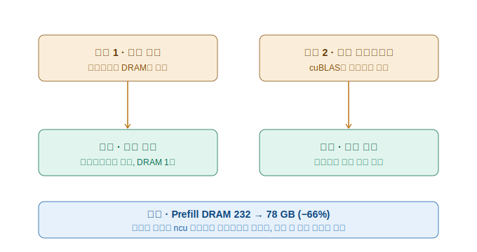
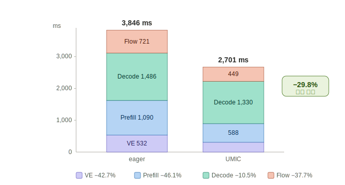
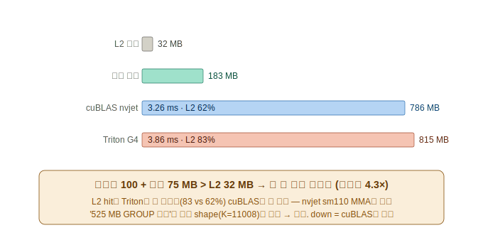
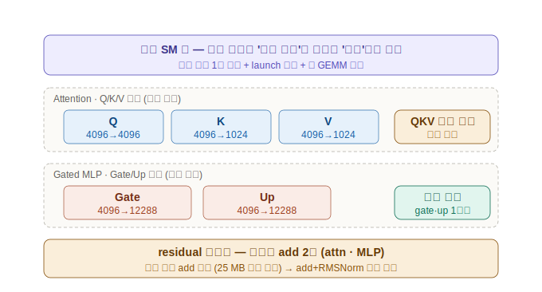

# UMIC 컴파일 엔진 — 그림으로 보는 최적화 원리, down_proj 정정, 다음 방향

**보고 날짜**: 2026-06-13
**대상 환경**: Jetson AGX Thor (SM 11.0, LPDDR5X 231 GB/s, GPU L2 캐시 32 MB) / Alpamayo 1.5 (BF16, 모델 무수정)
**코드·측정 데이터**: `github.com/soonhong99/umic`

> 이 보고서는 260612 보고서를 그림 중심으로 다시 쓴 것이다. 특히 260612 §3(down_proj·"L2 윈도 법칙")은
> 이번 추가 측정으로 **정정**되었으므로(§3), 그 부분은 이 문서로 대체한다. 어려운 용어는 처음 나올 때
> 괄호로 바로 풀어 쓴다.

---

## 0. 한 문장 요약

**PyTorch가 기본 실행하던 Alpamayo 추론을, 모델을 한 줄도 고치지 않고(가중치·정밀도 그대로) GPU가 메모리를
쓰는 방식만 바꿔서 동일 조건 −29.8% 단축했다(3,846 → 2,701 ms). 출력은 생성 토큰까지 동일하다.**

---

## 1. 최적화의 원리 — "두 종류의 낭비, 두 가지 처방"

문제의 핵심은 **DRAM(GPU가 쓰는 주메모리)을 너무 많이 오간다**는 것이었다. GPU 연산 자체는 빠른데,
데이터를 메모리에서 읽고 쓰는 길이 좁아서(231 GB/s 공유 버스) 거기서 시간이 샌다. 낭비는 두 갈래였고,
처방이 서로 다르다.

- **낭비 1 — 연산 분해**: PyTorch는 코드의 연산 하나하나를 별도 GPU 프로그램(이하 "커널")으로 실행한다.
  커널과 커널 사이에서 중간 결과는 반드시 DRAM에 썼다가 다시 읽힌다. 예를 들어 정규화(RMSNorm, 벡터 크기를
  일정하게 맞추는 연산) 하나가 내부적으로 5개 커널로 쪼개져, 76 MB짜리 중간값이 다섯 번 DRAM을 오갔다.
  → **처방: 커널 융합** — 여러 단계를 한 커널 안에서 처리해, 중간값이 DRAM에 안 내려가고 SM(연산 코어 묶음)
  안의 레지스터(가장 빠른 메모리)에서 바로 다음 단계로 넘어가게 한다.

- **낭비 2 — 기성 라이브러리의 부적합**: 행렬곱은 NVIDIA의 기성 라이브러리 cuBLAS가 실행하는데, 이 커널들은
  메모리가 넉넉한 서버용 GPU에 맞춰져 있어 속도를 위해 같은 가중치를 여러 번 다시 읽는다. Thor처럼 메모리가
  좁은 환경에선 손해다.
  → **처방: 그 지점만 자체 커널로 교체.** 단 **측정해서 이긴 곳만** 바꾼다(전부 바꾸지 않는다).

모든 결정은 **measurement-guided**(추정이 아니라 ncu라는 하드웨어 측정 도구로 실제 DRAM 바이트를 보고
판단) 원칙을 따랐다. 이 원칙이 이번에도 잘못된 길을 여러 번 막아 주었다(§3).

---

## 2. 단계별 결과 — 어디서 얼마를 줄였나

Alpamayo 추론은 4단계로 흐른다: **Vision Encoder**(카메라 영상을 이해), **LM Prefill**(상황 설명문을
한꺼번에 읽어 들이는 단계), **LM Decode**(추론 문장을 한 글자씩 생성, 19스텝), **Flow Matching**(최종 주행
궤적을 그리는 단계). 아래 그림에서 두 기둥의 전체 높이가 추론 1회 시간이고, 색 구간이 각 단계다.

| 단계 | eager | UMIC | 개선 | 주된 처방 |
|------|-------|------|------|-----------|
| Vision Encoder | 532 ms | 305 ms | −42.7% | LayerNorm·RoPE 융합 |
| LM Prefill | 1,090 ms | 588 ms | −46.1% | FFN·RMSNorm·RoPE 융합 + q/o 자체커널 |
| LM Decode | 78.2 ms/step | 70.0 ms/step | −10.5% | In-place KV 캐시 + CUDA Graph |
| Flow Matching | 721 ms | 449 ms | −37.7% | In-place KV 캐시 + 융합 재사용 |
| **전체 (19 step)** | **3,846 ms** | **2,701 ms** | **−29.8%** | — |

Decode 단계만 개선폭이 작은데, 이는 **이미 물리 하한 부근**이기 때문이다(매 글자마다 가중치 15 GB를 새로
읽는 것 자체가 일이라 더 깎을 바이트가 없다). 나머지 세 단계는 융합으로 DRAM 트래픽을 절반 가까이 줄였다.

> 2026-06-13 보드 재부팅(펌웨어 업데이트로 초기화) 직후 같은 조건에서 재현했더니 VE 260 / Prefill 596 /
> Decode 72.5 / Flow 421 ms로, 위 공식값을 재확인했다(깨끗한 보드라 오히려 약간 더 좋게 나옴).

---

## 3. down_proj — "더 줄일 수 있을 줄 알았는데, 하한이었다" (260612 §3 정정)

LM Prefill에 남은 가장 큰 낭비처럼 보였던 곳이 FFN의 마지막 행렬곱 **down projection**(12288차원을 4096으로
줄이는 연산)이다. cuBLAS가 이론의 4.3배(786 MB)를 옮기고 있어서, 자체 커널로 잡으면 prefill을 더 깎을 수
있을 것으로 기대했다. **그러나 이번 추가 측정으로 그 기대가 틀렸음이 확정됐다.**

검증 방법은 **한 번의 추론 안에서 layer마다 cuBLAS와 자체 커널을 번갈아 배치**하고(그래야 같은 보드 상태·같은
조건에서 공정 비교), 각 실행 시간을 하드웨어 타이머로 잰 것이다(이전의 "밤새 따로 측정"은 보드 상태가 ±30 ms
흔들려 신뢰할 수 없었다). 결과:

- **in-model 실측: cuBLAS 3.19 ms vs 자체 커널 4.22 ms** — 즉 자체 커널이 오히려 +1.0 ms/launch 느리다
  (36개 layer 위치 전부 일관, 전체 prefill 비교로도 교차검증).
- ncu로 원인을 보니: 두 커널 모두 ~800 MB를 옮긴다(이론 183 MB의 4.3배). **down의 가중치(100 MB)와 입력
  (75 MB)이 둘 다 L2 캐시(32 MB)를 넘어서, 어떤 커널도 타일 재독(같은 데이터를 여러 번 다시 읽음)을 피할 수
  없다.** byte를 cuBLAS 아래로 내릴 방법이 이 형상에선 없다.
- cuBLAS가 더 빠른 이유는 byte가 아니라 **스케줄링**이다 — NVIDIA의 nvjet 커널이 Thor(sm110)에 맞춰진
  효율적인 행렬곱 방식(큰 타일, 2-CTA 협력)이라, 같은 byte 예산에서 우리 자체 커널보다 빠르다.

**중요한 정정**: 260612 §3에서 "묶음 크기를 바꾸면 525 MB까지 떨어진다"고 보고했던 **"L2 윈도 법칙"은
존재하지 않는 형상(중간차원 11008로 잘못 가정)의 산물이었다.** 모델의 실제 중간차원은 12288이고, 그 진짜
형상에선 어떤 설정도 cuBLAS보다 적게 옮기지 못한다. 따라서 이 "법칙"과 "down_proj 부활 시 추가 −50 ms"
서술은 **철회한다.**

**이게 준 진짜 결론은 부정적이지 않다**: down의 28 GB는 "못 잡은 낭비"가 아니라 **이 하드웨어·이 형상의
하한**이다. prefill의 byte 줄이기는 여기서 끝났다는 것을 측정으로 확정한 것이다. 그리고 부수적으로 얻은
**방법론 법칙**(엔진 일반화에 중요): *격리 마이크로벤치는 cuBLAS 비용을 과대측정하므로, 커널 채택은 반드시
실모델 안에서 번갈아 측정해 판정해야 한다.*

---

## 4. 다음 방향 — LM 블록 구조가 가리키는 융합 기회

down이 닫혔으니, 다음은 **LM 블록의 구조 자체가 열어 주는 기회**를 본다. 핵심 전제를 먼저 분명히 해야 한다:
**Thor의 GPU는 단일 SM 풀(연산 코어 묶음 하나, 20개)이다.** 그래서 독립적인 두 연산을 "동시에" 돌려도 같은
20개 코어를 나눠 쓸 뿐 빨라지지 않는다. **독립성을 이 환경에서 활용하는 길은 하드웨어 병렬이 아니라 융합**이다
— 공유 입력을 한 번만 읽고, 실행 횟수를 줄이고, 더 큰 행렬곱으로 만들어 효율을 올리는 것(§3에서 nvjet가 이긴
바로 그 "큰 타일 효율").

- **Gate/Up (이미 완료)**: FFN의 gate·up 두 행렬곱은 같은 입력을 읽는 독립 연산이다. 이미 한 커널로 융합돼
  있다(`gate_silu_mul`). 이것이 prefill 최대 효과(−84 GB)의 출처다.
- **Q/K/V (후보, 측정 필요)**: attention의 Q·K·V 세 행렬곱도 같은 입력을 읽는 독립 연산인데, 현재는 따로
  실행된다. 셋을 하나의 행렬곱(가중치를 이어 붙여 4096→6144)으로 묶는 **fused QKV**가 후보다. 단 공유 입력
  (25 MB)이 L2(32 MB)에 들어가서 DRAM 절감은 작을 것이고, 이득은 주로 실행 횟수 감소와 큰 행렬곱 효율에서
  나온다. **확실한 승리가 아니므로 down에서 쓴 것과 같은 in-model 번갈아 측정으로 판정한다.**
- **Residual 재사용 (후보)**: 블록의 잔차 연결(residual, 입력을 출력에 더해 학습을 안정시키는 우회로)은 블록당
  두 곳(attention 뒤·MLP 뒤)에서 더해진다. 현재 이 덧셈이 별도 커널이라 25 MB 텐서를 매번 왕복시킨다. 이
  덧셈을 바로 뒤의 정규화 커널에 접어 넣는 **add+RMSNorm 융합**이 후보다(작지만 깨끗·저위험).

### 우선순위 (ROI 기준)

1. **Flow CUDA Graph**(−30 ms급, 기계적) + **Flow 미상 14 GB 복사 규명** — 가장 확실한 잔여.
2. **add+RMSNorm(residual) 융합** — 작지만 저위험.
3. **fused QKV** — 측정으로 채택 여부 결정(불확실).
4. **엔진 자동화** — 패턴 자동 탐지·형상 자동 채취·설정 자동 튜닝. "엔진"의 정의이자 일반화 주장의 핵심
   (§3의 "12288 사건"이 자동 형상 채취 필요성의 직접 증거).

---

## 5. 핵심 메시지

- 큰 낭비(중간값 물질화, 불필요한 복사, 가중치 재독)는 **거의 다 잡았다** — 동일 조건 −29.8%, 출력 등가,
  모델 무수정·비양자화.
- down_proj은 "못 잡은 낭비"가 아니라 **하드웨어 하한**임을 측정으로 확정했다(기대했던 추가 이득은 없음 —
  정직하게 철회).
- 남은 길은 byte 사냥이 아니라 **구조적 융합**(Q/K/V·residual)과 **엔진 자동화**, 그리고 10 Hz 연속 추론
  파이프라인이다.

### 참고
| 항목 | 위치 |
|------|------|
| down_proj in-model A/B·ncu 원자료 | `umic` repo `results/260613_down_inmodel_ab_findings.md` |
| 공식 벤치마크·출력 등가성 | `umic` repo `results/260611_official_benchmark.md`, `260611_output_equivalence.md` |
| 그림 원본(SVG) | `docs/2606_1주차/figures/260613_fig{1..4}_*.svg` |
