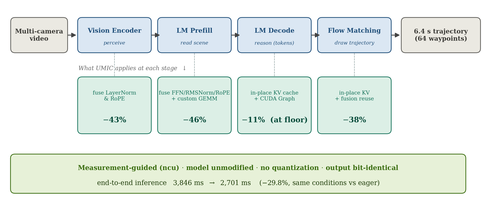
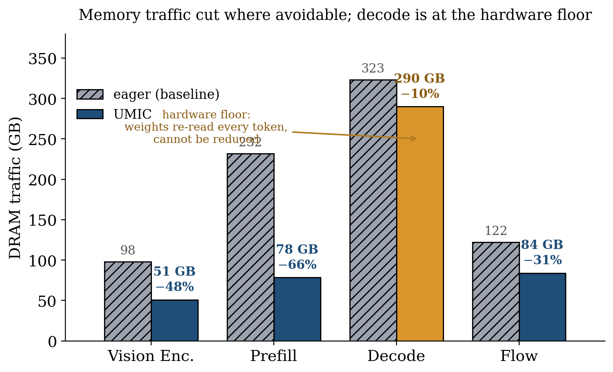
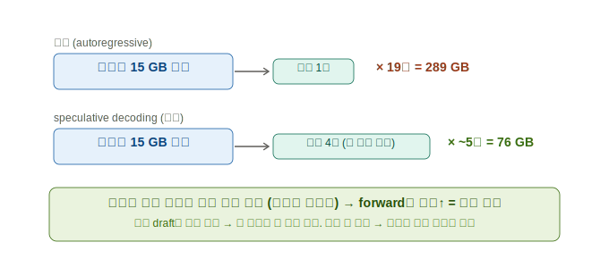

# DRAM을 얼마나 줄였나, 왜 여기서 더 못 줄이나, 그리고 다음 — 알고리즘으로 한계를 깨기

**날짜**: 2026-06-14
**환경**: Jetson AGX Thor (LPDDR5X 231 GB/s, GPU L2 32 MB) / Alpamayo 1.5 (BF16, 모델 무수정)

> 한 줄: **"트럭(메모리)을 덜 굴리는" 최적화는 하드웨어 바닥에 닿았다(−35% DRAM). 남은 대부분은 '반드시
> 읽어야 하는 가중치'다. 더 줄이려면 트럭을 더 줄이는 게 아니라, 트럭 한 대에 더 많은 일을 싣는 알고리즘으로
> 올라가야 한다.**

---

## 전체 구조 한눈에

UMIC은 Alpamayo 추론의 네 단계(영상을 이해하는 Vision Encoder → 상황을 읽어 들이는 LM Prefill → 추론
문장을 만드는 LM Decode → 궤적을 그리는 Flow Matching) 위에서, **각 단계의 병목만 측정으로 골라** 커널을
합치거나(융합) iGPU에 맞는 자체 커널로 바꾼다. 모델을 한 줄도 안 고치고, 양자화도 없이, 출력은 그대로다.



---

## 1. 지금까지 DRAM 읽기/쓰기를 얼마나 줄였나

(복습) GPU는 **공장**, DRAM은 **창고**, 그 사이 **좁은 1차선 도로**가 메모리 대역폭이다. AI가 느린 진짜
이유는 일꾼이 아니라 **이 도로의 정체**다. UMIC은 계산을 안 바꾸고(답 동일) 도로 위 트럭을 줄였다.

지난 보고(260611)에서 잰 것과 같은 방식(ncu 하드웨어 카운터)으로, eager(전) 대비 현재 UMIC(후)의 단계별
DRAM 전송량이다.



| 단계 | eager DRAM | UMIC DRAM | 감소 | 무엇으로 |
|------|-----------|-----------|------|----------|
| Vision Encoder | 98.1 GB | **50.7 GB** | **−48%** | LayerNorm·RoPE 융합 |
| LM Prefill | 232.0 GB | **78.3 GB** | **−66%** | FFN·RMSNorm·RoPE 융합 + q/o 자체커널 |
| LM Decode | 323.4 GB | **≈290 GB** | −11% | KV 복사 제거 (이미 하한 부근) |
| Flow | 122.1 GB | **83.9 GB** | **−31%** | KV in-place + 융합 재사용 |
| **합계** | **≈776 GB** | **≈503 GB** | **−35%** | — |

**큰 단계(VE·Prefill·Flow)는 절반 안팎을 잘라냈다.** 그런데 표를 보면 한 단계가 유난히 안 줄었다 — Decode다.
이게 다음 이야기의 핵심이다.

---

## 2. 왜 여기서 더 못 줄이나 — "피할 수 있는 낭비"와 "피할 수 없는 짐"

UMIC이 지운 것은 전부 **피할 수 있던 낭비**였다:
- 중간 계산 결과가 도로를 왕복하던 것 (커널 융합으로 레지스터에 묶음)
- 같은 짐을 괜히 여러 번 나르던 것 (RoPE 사본, KV 복사)
- 라이브러리가 가중치를 불필요하게 다시 읽던 것 (자체 커널)

이걸 다 지우고 나면, 남는 것은 **피할 수 없는 짐 = 반드시 읽어야 하는 모델 가중치**다. 그리고 여기엔
물리 법칙이 하나 걸린다:

> **트럭의 냉장칸(L2 캐시)은 32 MB뿐인데, 모델 가중치는 약 15 GB다.** 15 GB를 32 MB에 담아둘 수 없으므로,
> 가중치를 쓸 때마다 **매번 창고(DRAM)에서 새로 실어와야 한다.** 이건 어떤 커널 기교로도 못 피한다.

단계별로 이 "하한"이 다르게 나타난다:

- **Decode(글자 한 개씩 생성)**: 토큰 한 개를 만들 때마다 **15 GB 가중치를 통째로 다시 읽는다.** 19개 토큰을
  만들면 19 × 15 GB ≈ **289 GB**(이 값은 측정이 아니라 물리에서 바로 나온다 — 가중치 15 GB × 19회).
  eager 측정값 323 GB의 거의 전부가 이 "어쩔 수 없는 가중치 읽기"이고, UMIC은 그 위에 얹혀 있던 KV 복사만
  걷어내 ≈290 GB가 됐다. 그래서
  Decode는 대역폭의 89%를 이미 꽉 채우고 있고(205/231 GB/s), UMIC이 더 깎을 게 거의 없었다(−11%, 그나마
  KV 복사 제거분).
- **Prefill·VE**: 가중치를 **한 번만** 읽으면 되는 구조라(여러 토큰을 한꺼번에 처리) 융합으로 중간결과 낭비를
  지우니 크게 줄었다(−66%, −48%). 여긴 이미 하한 근처.
- **Flow**: expert 가중치를 ODE 10 step마다 다시 읽는다(Decode와 비슷한 반복 읽기). 복사는 지웠지만 반복
  읽기 자체는 남아 −31%에서 멈춤.

**결론(정직하게): 커널·바이트 수준 최적화는 바닥에 닿았다.** 남은 503 GB의 절반 이상이 Decode의 "어쩔 수
없는 가중치 읽기"이고, 이건 커널을 아무리 잘 짜도 못 줄인다. 줄이는 길은 딱 둘:
1. 가중치를 **더 적게** 만든다 → 양자화 (이 연구 범위 밖)
2. 가중치를 **더 적은 횟수** 읽는다 → **알고리즘을 바꾼다** ← 여기서부터가 다음 단계

---

## 3. 한계를 깨는 열쇠 — "메모리 바운드 구간에선 한 번에 더 많이 처리해도 한계 비용이 거의 0"

여기서 상식을 한 번 뒤집는 관찰이 나온다. 도로가 꽉 막혀 있을 때(메모리 바운드), **트럭 한 대(가중치 15 GB
읽기)에 짐(토큰)을 1개 싣든 4개 싣든 트럭 비용은 거의 똑같다.** 토큰 하나가 추가로 쓰는 도로는 가중치
15 GB에 비하면 먼지 수준이기 때문이다.

수식으로도 깔끔하다. forward 한 번의 도로 사용량은

```
비용(forward) ≈ (가중치 15 GB) + (토큰 수 × 토큰당 작은 활성값)
            ≈ 15 GB                          ← 토큰 수에 거의 무관
```

즉 **iGPU처럼 메모리가 병목인 환경일수록, "forward 한 번에 유용한 일을 더 많이 몰아넣는" 기법의 이득이
극대화된다.** 이것이 단순한 트릭이 아니라, 우리 환경(작은 L2·통합메모리)에서 **증명되는 일반 원리**다.
최적화의 전선이 *"forward당 바이트 줄이기"(끝남)* 에서 *"weight-read당 일 늘리기"(시작)* 로 이동한다.



이 원리를 각 단계에 적용하면 두 개의 구체적 아이디어가 나온다. 둘 다 **모델 무수정·일반화 가능·구현 단순**
하다.

### 아이디어 ① Decode → Speculative Decoding (출력 등가, iGPU에 특히 유리)

- **무엇**: 작은 "초안 작성자(draft)"가 다음 토큰 몇 개를 **미리 짐작**하고, 큰 모델이 그 몇 개를 **한 번의
  forward로 한꺼번에 검증**한다. 맞은 건 채택, 틀린 건 버린다.
- **왜 통하나(수학)**: Decode DRAM = (forward 횟수) × 15 GB = (토큰 수 ÷ 평균 채택 길이) × 15 GB.
  평균 채택 길이가 4면 forward가 1/4로 줄어 **Decode DRAM이 약 4배 감소**(290 → ~75 GB급).
- **왜 우리 환경에 특히 유리한가**: 일반(연산 바운드) GPU에선 "여러 토큰 검증"이 연산을 늘려 이득이 일부
  상쇄된다. 그러나 **메모리 바운드 iGPU에선 4개 검증이 1개와 거의 같은 비용**(연산은 놀고 있고 도로만
  병목)이라 이득이 거의 그대로 실현된다. → **"speculative는 memory-bound일수록 유리"가 정리로 성립.**
- **출력 등가**: 검증이 틀린 짐작을 버리므로 결과 토큰은 **비트 단위로 동일**. 우리의 "무수정·비양자화·출력
  등가" 원칙과 완벽히 맞는다.
- **단순·일반화**: 초안을 작은 head(Medusa류)나 n-gram/prompt-lookup으로 — 모델을 안 건드리고 붙일 수
  있고, 어떤 autoregressive LM에도 적용된다.

### 아이디어 ② Flow → 더 높은 차수의 ODE 풀이로 step 수 줄이기

- **무엇**: Flow는 궤적을 10번의 작은 적분 step(Euler, 1차)으로 그린다. 매 step이 expert 가중치를 다시
  읽으므로 **Flow DRAM ∝ step 수**. 더 똑똑한 적분기(Heun·midpoint 2차, DPM-Solver 등)는 **같은 정확도를
  더 적은 step으로** 낸다.
- **왜 통하나(수학)**: 1차 Euler의 step당 오차는 O(h²), 2차 적분기는 O(h³). 같은 목표 정확도 ε를 1차는 N
  step, 2차는 대략 √N 수준의 step으로 달성 → **10 step → 4~5 step**이면 Flow 가중치 읽기 **반감**(84 → ~45 GB급).
- **단순·일반화**: 적분기만 교체. 모든 flow matching/diffusion 모델에 적용. 양자화가 아니라 **정밀도는 그대로
  두고 step 수만 줄이는 것**이라 우리 범위 안.
- **주의**: step 감소는 근사이므로 출력이 미세히 변한다 → **궤적 정확도(ADE) 게이트로 검증** 후 채택(우리가
  RoPE·융합에 쓴 fp32 기준 검증과 동일한 방식).

### (참고) VE·모듈 통신은 큰 레버가 아님 — 이미 하한 근처

- **VE**: autoregressive가 아니라 모든 패치를 한 번에 처리 → "토큰 나눠 싣기" 이득이 없다. 가중치 1회 읽기
  하한에 이미 융합으로 도달.
- **모듈 통신(VE→LM→Flow)**: KV 캐시 공유의 복사 낭비는 이미 in-place로 제거. 통합 메모리라 모듈 간
  "전송"이 애초에 없어(가중치가 처음부터 DRAM 상주) 숨길 거리가 없다 — 이건 지난 보고에서 측정으로 확인됨.

---

## 4. 정리 — 어디까지 왔고 어디로 가나

- **커널·바이트 최적화: 완료(−35% DRAM, 하드웨어 하한 도달).** 남은 503 GB의 대부분은 "반드시 읽어야 하는
  가중치"라 커널로는 못 줄인다.
- **다음은 알고리즘 층.** 한 가지 증명되는 원리 — *메모리 바운드 구간에선 weight-read당 일을 늘리는
  한계 비용이 거의 0* — 가 두 개의 구체적 길을 연다:
  - **Decode → Speculative Decoding** (출력 등가, iGPU에서 이득 최대, Decode DRAM ~4배↓ 잠재력)
  - **Flow → 고차 ODE solver** (정밀도 유지, step 반감 → Flow DRAM ~2배↓ 잠재력)
- 그다음이 **10 Hz 연속 추론 파이프라인**(프레임 간 중첩)과 **엔진 자동화**(이 모든 결정 규칙의 기계화)다.

> 핵심 메시지: **"트럭 줄이기"는 끝났다. 이제 "트럭 한 대에 더 많이 싣기"(알고리즘) 차례다.** 그리고 이게
> 통하는 이유 자체가 iGPU의 작은 L2가 만드는 메모리 바운드 — 즉 **우리 환경에서 특히 강하게 성립하는
> 정량 법칙**이다.

### 참고 자료
| 항목 | 위치 |
|------|------|
| 단계별 DRAM 측정(전) | `docs/2606_1주차/260611_교수님_보고서_DRAM대역폭_측정결과.md` |
| UMIC 단계별 감소(후)·하한 | `umic` repo `results/260613_*_findings.md`, 본 문서 §1 |
| 그림 원본 | `docs/2606_2주차/figures/260614_fig{1,2}_*.svg` |
