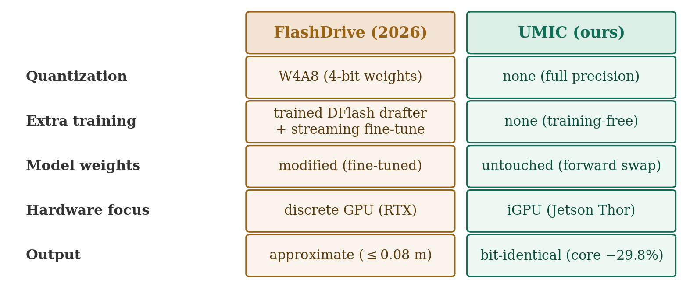
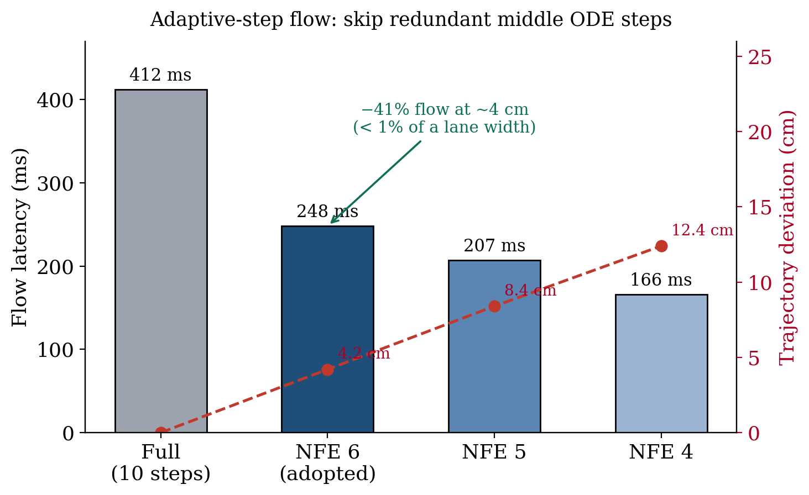

# FlashDrive와 우리(UMIC)의 차이, 배울 점, 그리고 우리가 구현한 것 (Adaptive-step Flow)

**날짜**: 2026-06-14
**대상 논문**: *FlashDrive: FlashVision-Language-Action Inference for Autonomous Driving*
(Li, Liang, Zhang, Chen, Liu — UC San Diego/Princeton, 2026). 대상 모델: Alpamayo 1.5 (우리와 동일).

---

## 0. 한 줄

FlashDrive는 **양자화 + 파인튜닝 + 학습된 drafter를 다 써서** Alpamayo를 4.5× 빠르게 했다. 우리의
차별점은 **양자화·모델수정·학습 없이(출력 비트동일), 측정으로 검증된 결정 규칙으로 iGPU 고유의 답을
찾는 것**이다. 이번에 그 정신으로 FlashDrive의 가장 깨끗한 기법(adaptive-step flow)을 **Thor에서 구조를
먼저 측정 확인한 뒤** 구현했다 (flow −41%).

---

## 1. FlashDrive가 한 일 (요약)

Alpamayo의 4단계(encode/prefill/decode/action)를 전부 공략:

| 기법 | 단계 | 효과(RTX) | 핵심 |
|------|------|-----------|------|
| Streaming inference | encode/prefill | 3.5× / 3.1× | 프레임 간 KV 재사용 + **action expert 파인튜닝** |
| Speculative reasoning | decode | 4.3× | **학습된** 2층 diffusion drafter(DFlash), 수락 5.6토큰 |
| Adaptive-step flow | action | 2.5× | 속도장 U자 → 중간 step 캐싱 (NFE 10→4) |
| CUDA Graph + 융합 | 전체 | 1.39× | Q/K/V·gate/up 융합 + graph |
| **W4A8 양자화** | 전체 | +14% | weight 4bit + activation 8bit |

결과: 716→159 ms (4.5×, **양자화 포함**). **Jetson Thor도 측정**: 3770→943.6 ms (4.0×) — 단, 이 943ms는
위 모든 기법(양자화·파인튜닝·학습 drafter)을 다 켠 값이고 **단계별 Thor 분해는 없다.**

---

## 2. 우리와 무엇이 다른가

| 축 | FlashDrive | 우리 (UMIC) |
|----|-----------|-------------|
| 양자화 | W4A8 사용 (최종 속도의 일부) | **사용 안 함** (정밀도 그대로) |
| 모델 수정 | streaming은 action expert 파인튜닝, decode는 drafter 학습 | **무수정·무학습** (forward만 교체) |
| 출력 | 근사 (≤0.08m 손실, 일부 개선) | **비트동일** 우선(−29.8%), 근사는 opt-in 분리 |
| 하드웨어 | RTX PRO 6000 중심(디스크리트), Thor는 총합만 | **Thor(iGPU) 중심**, 단계별 측정 |
| 방법론 | "다 켜서" 4.5× | **측정된 부등식으로 무엇이 통하는지 규명** |

**핵심 차별: 측정이 그들의 일반화를 부분 반박한다 (iGPU 고유).** FlashDrive는 "CUDA Graph가 action에
도움(작은 커널 많음)"이라 했지만, 우리는 **Thor에서 flow CUDA Graph가 +211 ms 손해**임을 측정했다
(260613). 빠른 디스크리트 GPU는 커널이 빨리 끝나 GPU가 CPU를 기다리는 유휴가 크지만, **대역폭이 좁은
Thor는 커널이 오래 걸려 GPU가 안 굶어** graph 이득이 없다. → 같은 기법도 iGPU에선 답이 다르고, 그걸
가르는 것이 우리 기여다.

---

## 3. 배울 점

1. **Adaptive-step flow가 우리의 "고차 ODE solver" 아이디어보다 낫다.** 균일하게 step을 줄이는 대신,
   속도장이 **양 끝은 급변·중간은 거의 일정(U자)** 이라는 구조를 이용해 **중간만 건너뛴다.** 무학습·무양자화·
   거의 무손실이라 우리 원칙에 완벽히 맞는다. → 이번에 구현(§4).
2. **4단계 분해가 우리와 동일** — 우리 프레이밍이 옳았다는 검증.
3. 기법들은 **이미 알려진 것** — 우리 가치는 발명이 아니라 **iGPU 고유 실행 + 측정 규율 + 무양자화/무수정
   제약 하의 한계 규명**에 있다.

---

## 4. 우리가 구현한 것 — Adaptive-step Flow (Thor)

FlashDrive는 RTX에서 U자 구조를 관찰했다. 우리는 **추측하지 않고 Thor에서 먼저 측정**했다:

- **U자 확인**: flow 10 step의 속도를 step마다 기록 → 연속 step 코사인 유사도가 **양 끝 0.994, 중간
  0.998**(상대변화 11%→6%→9%). 중간이 더 비슷 = 건너뛰어도 되는 구간. (Thor에서 성립 확인.)
- **구현**: `umic/diffusion.py`의 `fuse_adaptive_flow` — 첫 3·끝 3 step만 새로 계산하고 중간 4 step은
  직전 속도를 재사용(NFE 10→6). 모델·가중치 무수정, forward만 교체.
- **측정 결과 (Thor, flow ODE 시간 / full-10 대비 편차)**:

| 스케줄 | NFE | 궤적 편차 | flow 시간 |
|--------|-----|----------|-----------|
| full | 10 | 0 | 412 ms |
| **NFE6 (채택)** | 6 | **4.2 cm** | **248 ms (−40%)** |
| NFE5 | 5 | 8.4 cm | 207 ms (−50%) |
| NFE4 (FlashDrive 선택) | 4 | 12.4 cm | 166 ms (−60%) |

- **공식 e2e 검증**: `--fuse-adaptive-flow` 켜고 전체 파이프라인 실행 → **Flow 421→247 ms (−41%)**,
  VE/Prefill/Decode 불변. 4 cm는 6.4초·차선폭 3.5 m 기준 약 1%.
- ⚠ 이건 **근사**다(UMIC의 비트동일 융합과 다른 클래스). 그래서 **opt-in**으로 두고, 비트동일 −29.8%와
  분리해 "fast mode: 추가 −6%(e2e) at ~4 cm"로 보고한다. 최종 NFE는 GT(minADE6) 기준 정확도 게이트로
  결정 예정.

---

## 5. 정리 — 우리의 위치

- FlashDrive와 **경쟁이 아니라 보완**이다. 그들은 "다 켜서 양자화까지" 4.5×. 우리는 **"모델을 못 건드리고
  양자화도 못 쓸 때(인증·안전), 측정으로 어디까지 가능한가"** 를 iGPU에서 규명한다.
- 이번 adaptive-step flow는 그 정신의 첫 사례: **그들의 기법을 Thor에서 구조 측정 후 무수정·무양자화로
  재구현**, flow −41%.
- 다음 후보(전부 무양자화·무수정 변형): **학습 없는 speculative decoding**(prompt-lookup/n-gram — 그들의
  학습 drafter 대비), 그리고 streaming inference의 무파인튜닝 가능성 검토.

### 참고
| 항목 | 위치 |
|------|------|
| adaptive flow 측정·코드 | `umic` repo `results/260614_flow_adaptive_findings.md`, `src/umic/diffusion.py` |
| flow CUDA graph 기각(iGPU 반박) | `umic` repo `results/260613_flow_graph_findings.md` |
| DRAM 하한·다음 방향 | `docs/2606_2주차/260614_01_*.md` |
