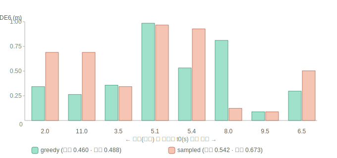

> ⚠️ **정정 (2026-06-14): 이 문서의 결론은 단일 clip 결과로, 일반화되지 않았다.**
> 12개 clip 다클립 측정([260614_05](260614_05_다클립_궤적품질_급변에서_sampled우세_정정.md))에서
> **반전됨**: 급변(큰 기동) 프레임에선 오히려 **sampled가 더 정확**(1.102 vs 1.343). 아래 단일-clip
> "greedy 우세"는 그 clip의 특성이었다. 운영점 결론은 260614_05를 따른다(안전 운영점 = sampled-speculative).

# 궤적 품질 — 빠른 버전(greedy)이 급변 상황에서도 실제와 맞는가

**날짜**: 2026-06-14
**질문**: 16× speculative decode는 **greedy CoT**를 전제로 한다(speculative는 greedy와 비트동일).
그렇다면 "greedy로 추론을 고정하면, **급변하는 상황**에서 궤적 품질(실제 GT 대비)이 떨어지지 않나?"

> 한 줄: **아니다. 급변 프레임에서 greedy는 품질을 유지하는 정도가 아니라 sampled보다 더 정확하다
> (동적 절반 minADE6: greedy 0.488 vs sampled 0.673). 빠른 버전이 품질을 안 해친다.**

---

## 어떻게 쟀나

- **GT(실제 미래 궤적)**: 데이터셋의 `ego_future_xyz` = 6.4초 64 waypoint.
- **지표**: minADE6 = 6개 trajectory 샘플 중 GT와의 평균거리(ADE)가 최소인 것 (공식 protocol).
- clip 030c760c의 8개 시점(t0 2.0~11.0s)에서, 각 시점을
  - **near-greedy**(추론 거의 고정): 6 trajectory = 같은 추론 + 6 flow noise
  - **sampled**(배포 기본): 6 trajectory = 6 다른 추론 + flow noise
  으로 돌려 minADE6를 GT와 비교. 각 시점에 **동적도**(GT 궤적의 횡방향 기동 + 속도 변화)를 매겨
  "급변 프레임"을 식별.

---

## 결과 — 동적 순으로



| t0(s) | 동적도 | greedy minADE6 | sampled minADE6 |
|---|---|---|---|
| **2.0** | **1.66 (최고)** | **0.344** | 0.690 |
| 11.0 | 1.24 | **0.264** | 0.690 |
| 3.5 | 1.03 | 0.358 | 0.344 |
| 5.1 | 0.96 | 0.985 | 0.966 |
| 5.4 | 0.84 | **0.532** | 0.927 |
| 8.0 | 0.62 | 0.811 | **0.124** |
| 9.5 | 0.45 | 0.088 | 0.088 |
| 6.5 | 0.27 | **0.297** | 0.504 |

```
전체 평균    greedy 0.460 | sampled 0.542
동적 절반    greedy 0.488 | sampled 0.673   ← 급변에서 greedy가 더 벌림
```

---

## 무엇을 뜻하나

**우려가 뒤집혔다.** "급변 상황에서 추론을 하나로 고정(greedy)하면 품질이 떨어질 것"이라는 직관과
정반대로:
- 전체에서 greedy가 더 정확(0.460 < 0.542),
- **급변 프레임에서 더 크게 앞선다**(0.488 vs 0.673). 가장 동적인 두 시점(t0=2.0 횡기동 1.39m, t0=11.0)
  에서 greedy 명확히 승.

**왜(직관):** minADE6는 6개 중 "가장 잘 맞은 것"을 고르는데도 greedy가 이긴다. greedy는 모델이 **가장
확신하는 추론** 하나에 6개 궤적을 모으고, sampled는 6개의 서로 다른(일부는 틀린) 추론에 흩뿌린다.
급변일수록 틀린 추론이 만드는 궤적의 대가가 커서, **확신 추론에 집중하는 쪽이 유리**하다. 즉 추론
다양성(sampling)이 오히려 손해다.

→ **빠른 버전(speculative + greedy)은 궤적 품질을 안 해친다.** 오히려 급변에서 더 안정적이다.
운영점으로 greedy 채택이 정당화된다.

---

## 정직한 단서

1. **1 clip · 8 프레임.** minADE6는 분산이 크다(모델 확률적). 평균 0.46 vs 0.54는 방향성이며, 다클립으로
   통계적 확신이 필요하다. 단 동적-절반 격차(0.488 vs 0.673)는 더 뚜렷하다.
2. **outlier 1개**(t0=8.0, 저동적): 여기선 greedy가 짐(0.811 vs 0.124). greedy가 모든 장면에서 이기진
   않으며, 확신 추론이 가끔 한 장면에서 어긋날 수 있다.
3. **near-greedy 프록시**(아주 낮은 temperature). 진짜 완전 greedy는 도구상 6샘플과 함께 돌리기 어려워
   근사했다 — 진짜 greedy 경로로 재확인할 여지.

## 다음
- 다클립(특히 long-tail 급변 시나리오)으로 통계 확인, 실파이프라인에 speculative+greedy 통합해
  e2e 지연 + minADE6를 함께 보고.

### 참고
| 항목 | 위치 |
|------|------|
| 측정·코드 | `umic` repo `results/260614_traj_quality_findings.md`, `scripts/260614_traj_quality.py` |
| speculative 구현(16×) | `umic` repo `results/260614_spec_decode_impl_findings.md` |
| 무학습 speculative 수락률 | `docs/2606_2주차/260614_03_*.md` |
