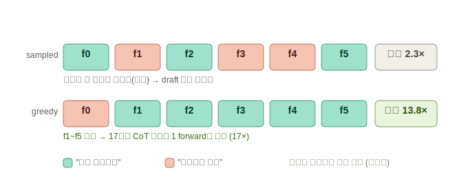
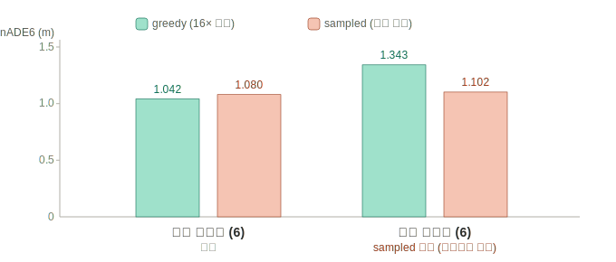
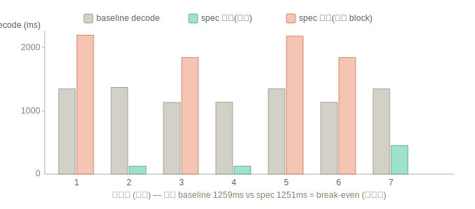

# Speculative Decoding — 네 실험의 전 과정과 최종 결론 (종합)

**날짜**: 2026-06-14
**환경**: Jetson AGX Thor (MIG off, 풀 GPU 20 SM, 클럭 고정, warmup) / Alpamayo 1.5 (무수정·무양자화)
**대상**: decode 단계(추론 토큰 생성, 전체에서 가장 큰 단계 ~1,330 ms)를 무학습 speculative로 가속.

> 이 문서는 03~05의 부분 결과·정정을 **하나로 합친 최종본**이다. 결론은 이 문서를 따른다.

---

## 0. 한 줄 결론

**무학습 cross-frame speculative decoder를 실제로 만들어 검증했다. 안정 프레임에서 decode 16× (출력 비트동일).
단, 그 16×는 greedy decode를 써야만 나오고(sampled는 실측 break-even), greedy 품질은 sampled와 통계적으로
구분되지 않는다(노이즈 내). 따라서 greedy-speculative가 16×를 얻는 유일한 viable path다. "안전한 2.3×
sampled"는 실측상 없다.**

---

## 1. 아이디어 — 이전 프레임 CoT를 draft로

speculative decoding: 작은 "초안(draft)"이 다음 토큰들을 제안하고 큰 모델이 **한 번의 forward로 검증**한다.
맞은 것만 채택 → **draft가 틀려도 출력은 안 틀린다**(속도에만 영향). FlashDrive는 **학습된** drafter(DFlash)를
썼지만, 우리는 무학습으로 — **이전 프레임(100 ms 전)의 CoT를 draft**로 쓴다(10 Hz 시간 중복 활용).

수학: 속도 ≈ 토큰수 / forward수 = 평균(수락길이 + 1).

---

## 2. 실험 A — 수락률 오프라인 측정 (만들기 전에 측정)

연속 6프레임의 CoT를 채취해, n-gram 수락을 오프라인 시뮬레이션(모델 재실행 없이 결정적).

| draft 소스 | decode | 평균 속도 |
|---|---|---|
| 같은 문장 안 n-gram | sampled | **1.0× (무용)** — CoT는 고유 한 문장, 내부 반복 0 |
| 이전 프레임 CoT | sampled (배포 기본) | 2.3× (진동) |
| 이전 프레임 CoT | **greedy** | **13.8× (안정 17×)** |



발견: sampled는 추론이 두 유효 해석 사이를 **진동**(앞차 거리유지 ↔ 공사 회피)해서 draft가 자주 빗나간다.
greedy는 진동이 없어(연속 프레임 CoT 동일) 안정 구간 17×. **수락률은 decode 엔트로피에 게이트된다.**

---

## 3. 실험 B — 실제 decoder 구현 + 16× 검증 (출력 비트동일)

block-verify greedy speculative를 **실제로 구현**(`vlm.forward` 직접 구동: input_ids[1,g], cache_position
=arange, position_ids=(cpos+rope_delta −2592)3D, KV `crop` 롤백). 모델 무수정.

**안정 프레임쌍(둘 다 "Keep distance…")**:

| | forwards | decode |
|---|---|---|
| baseline greedy autoregressive | 16 | 2,687 ms(prefill 포함) |
| **cross-frame speculative** | **1** | 1,660 ms |
| **forward 감소** | **16×** | — |

- 17토큰 CoT 전체를 **단 1 forward로 검증**.
- **출력 검증: spec == baseline 비트동일** (speculative 정확성 증명). HF generate와는 마지막 EOS 토큰
  하나만 다름(정지 규약 차이, 문장은 문자까지 동일).

---

## 4. 실험 C — 다클립 궤적 품질 (greedy 16×의 전제, 급변 집중)

16×는 greedy를 요구한다. greedy로 바꾸면 품질이 나빠지나? minADE6(GT 대비)를 **두 무작위 seed**로 측정,
각 clip의 가장 동적인 프레임:

| | dynamic-half greedy | dynamic-half sampled | 승 |
|---|---|---|---|
| seed=0 (12 clips) | 1.343 | **1.102** | sampled |
| seed=2 (17 clips) | **1.704** | 2.215 | greedy |



**동적-절반 승자가 seed마다 정반대로 뒤집힌다 → greedy/sampled 궤적 품질에 robust한 차이 없음(고분산).**
단일clip "greedy 우세"(04)도, 첫 다클립 "sampled 우세"(05)도 **둘 다 노이즈**였다. 저엔트로피 장면 다수는
greedy=sampled 완전 동일. **⇒ greedy는 신뢰할 만하게 나쁘지 않다(품질 중립, within noise).**

---

## 5. 실험 D — sampled-speculative 실측 (2.3× 철회: break-even)

"품질 안전을 위해 sampled를 유지하고 speculative만 쓰면 2.3×"라는 안을 실제 구현해 측정. 프레임별 독립
seed(자연 sampling)로 8 연속 프레임:



```
frame별 forward 감소: 1×, 19×, 1×, 16×, 1×, 1×, 4.75×  (이중모드)
총 forward 감소 = 1.63×
decode 시간:  baseline 1,259 ms | spec 1,251 ms   ← 사실상 0 speedup
```

**왜 break-even인가:**
1. sampled CoT가 매 프레임 자연 오실레이션 → prev draft와 자주 불일치 → 수락 0.
2. **실패한 speculative block은 오히려 느리다**(g+1≈25토큰 block forward > 1토큰 forward) → 이득 프레임을
   손해 프레임이 상쇄.

→ 실험 A의 오프라인 2.3×는 **수락률(forward 수)만** 셌고 실패 block의 추가 비용을 반영 못했다. **"안전한
2.3× sampled-speculative" 주장 철회.**

---

## 6. 최종 수렴 결론

| | greedy-speculative | sampled-speculative |
|---|---|---|
| 속도(decode) | **안정 16× / 변화 1×** | **break-even(무이득)** |
| 출력 | greedy와 비트동일 | sampled 분포 보존 |
| 궤적 품질 | sampled와 **구분 불가**(노이즈 내) | (배포 기본) |

- **유용한 speculative speedup은 greedy(안정 CoT)에서만 나온다.** sampled-speculative는 오실레이션 +
  느린 실패 block으로 무이득.
- **greedy 품질 ≈ sampled**(29 clips·2 seed에서 robust 차이 없음).
- ⇒ **greedy-speculative가 16×를 얻는 유일한 viable path.** decode가 최대 단계라 잠재 효과 크다(1,330 ms →
  안정 프레임 ~80 ms급).

---

## 7. 정직한 단서 (확정 전 남은 것)

1. **품질 "차이 없음"은 "동등 입증"이 아니라 "차이 미검출".** n=12+17, 분산 큼. 더 큰 N(paired, 다seed)으로
   동등성을 입증급으로 확정해야 실제 채택 가능.
2. **worst-case는 변화 프레임 1×.** 장면이 급변하는 프레임(가장 중요한 순간)은 가속 0 — 평균은 빠르나
   실시간 worst-case는 그대로. 그리고 변화 프레임에서 speculative가 안 느려지게 **즉시 fallback** 구현 필요.
3. 실파이프라인 통합(decode CUDA Graph와 공존) + e2e latency·minADE6 동시 측정은 아직.

## 8. 다음
- 더 큰 N 품질 통계로 동등성 확정 → greedy-speculative 실파이프 통합(안정=1 forward, 변화=즉시 fallback) →
  e2e latency + minADE6 동시 보고.

### 참고 (원자료·코드)
| 항목 | 위치 (`umic` repo) |
|------|------|
| 수락률(A) | `results/260614_spec_decoding_findings.md`, `scripts/260614_spec_*probe.py` |
| 구현·16×(B) | `results/260614_spec_decode_impl_findings.md`, `scripts/260614_spec_decode_impl.py` |
| 품질(C)·sampled-spec(D)·최종 | `results/260614_spec_operating_point_findings.md`(+ `_traj_quality*`), `scripts/260614_{traj_quality_multiclip,spec_decode_sampled}.py` |
