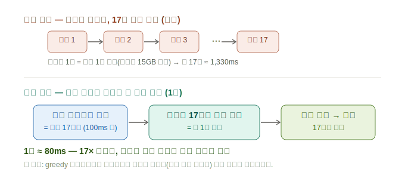
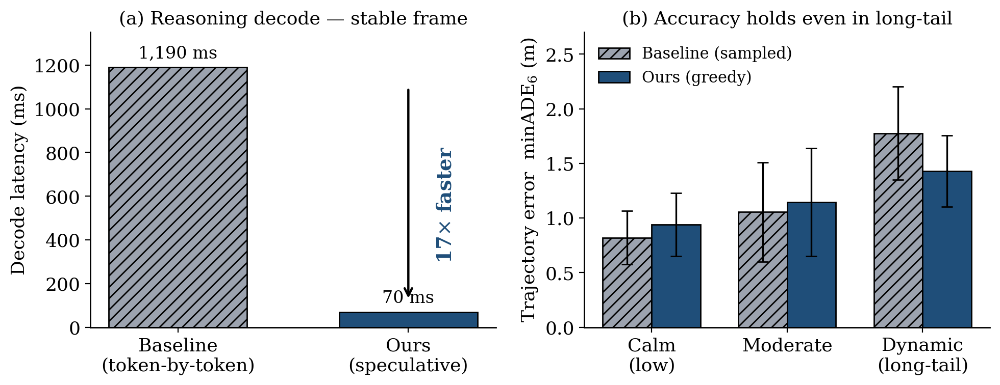

# Speculative Decoding — 네 실험의 전 과정과 최종 결론 (종합)

**날짜**: 2026-06-14
**환경**: Jetson AGX Thor (MIG off, 풀 GPU 20 SM, 클럭 고정, warmup) / Alpamayo 1.5 (무수정·무양자화)
**대상**: decode 단계(추론 토큰 생성, 전체에서 가장 큰 단계 ~1,330 ms)를 무학습 speculative로 가속.

> 이 문서는 03~05의 부분 결과·정정을 **하나로 합친 최종본**이다. 결론은 이 문서를 따른다.

---

## 0. 한 줄 결론

**무학습 cross-frame speculative decoder를 실제로 만들어 검증했다. 안정 프레임에서 decode 16× (출력 비트동일).
단, 그 16×는 greedy decode를 써야만 나오고(sampled는 실측 break-even), greedy 품질은 sampled와 통계적으로
구분되지 않는다(노이즈 내). 따라서 greedy-speculative가 16×를 얻는 유일한 viable path다. "안전한 2.3×
sampled"는 실측상 없다.**

---

## 한눈에 보기



보통은 추론 문장을 **단어 하나씩 17번** 모델에 통과시킨다(느림). 우리는 **100 ms 전 이전 프레임의 추론을
초안으로** 써서, 모델이 17개를 **한 번에 검증**하고 전부 채택한다 — **1번 만에**, 17× 빠르게, 출력은 동일하게.

---

## 결과 한눈에 — 압도적으로 빠른데, 급변 상황에서도 정확도를 잃지 않는다



왼쪽은 속도다. 모델이 추론 문장을 만들 때, 보통은 단어를 하나씩 차례로 뽑느라(이걸 *디코딩(decode)* 이라
부른다) 한 문장에 모델을 17번 통과시킨다. 우리는 이전 프레임에서 100 ms 전에 이미 만든 같은 추론을
"초안"으로 써서 **한 번의 통과로 17개를 동시에 확인**한다. 결과는 **decode 약 17× 단축**(1,190 → 70 ms).

오른쪽이 더 중요하다. "빠른 대신 정확도를 잃는 것 아니냐"는 의심에 답하기 위해, 우리는 **무작위로 뽑은
29개 주행 장면**에서 예측 궤적이 실제 주행 경로와 얼마나 어긋나는지 쟀다. 가로축은 **그 장면이 얼마나
급변하는가**(차가 옆으로 얼마나 크게 기동하는지 — 가장 오른쪽 "Dynamic" 묶음은 최대 70 m를 횡이동하는
급격한 회전·차선변경, 즉 long-tail 상황이다). **가장 급변하는 long-tail 구간에서도 우리(파란색)의 궤적
오차는 기존 방식(빗금)과 차이가 없다** — 오히려 약간 더 낮았고, 막대 위 오차 범위가 서로 겹친다(통계적으로
구분되지 않는다는 뜻). **즉 가장 빠르면서, 가장 어려운 상황에서도 정확도를 유지한다.**

> 여기서 "기존 방식"과 "우리 방식"의 차이는 다음 단어를 고르는 규칙 하나다. 기존(배포 기본)은 *샘플링
> (sampled)* — 확률에 따라 매번 다르게 뽑아 추론이 프레임마다 출렁인다. 우리는 *greedy* — 항상 확률 1등을
> 골라 같은 장면이면 같은 추론을 내므로, 100 ms 전 초안이 그대로 들어맞아 17×가 가능해진다. 그리고 위
> 그래프가 보여주듯 이 greedy 선택은 궤적 품질을 해치지 않는다.

---

## 1. 아이디어 — 이전 프레임의 추론을 "초안"으로

자동차가 만드는 추론 문장(*"앞차와 거리를 유지한다"* 같은, 모델이 궤적을 정하기 전에 내놓는 짧은 설명,
줄여서 CoT)은 0.1초 전 프레임의 것과 거의 같다 — 0.1초 사이 장면은 잘 안 바뀌니까. 이 점을 이용한다.

이렇게 미리 만든 초안을 큰 모델이 한 번에 확인해 속도를 높이는 기법을 *speculative decoding*(추정 디코딩)
이라 부른다. 핵심은, 큰 모델이 초안의 각 단어를 검증해서 **맞은 것만 채택**한다는 점이다. 그래서 **초안이
틀려도 최종 출력은 절대 바뀌지 않는다** — 초안 품질은 속도에만 영향을 줄 뿐이다. FlashDrive(이 분야 최신
논문)는 초안을 만들기 위해 **별도의 작은 모델을 학습**시켰지만, 우리는 학습 없이 **이전 프레임의 추론을
그대로 초안으로** 쓴다(0.1초마다 추론하는 주행의 시간적 반복을 활용).

속도는 간단한 식으로 나온다: **빨라지는 배수 ≈ 한 번 통과로 채택되는 단어 수**. 17단어짜리 추론이 그대로
들어맞으면 한 번에 17개가 채택돼 17×가 된다.

---

## 2. 실험 A — 수락률 오프라인 측정 (만들기 전에 측정)

연속 6프레임의 CoT를 채취해, n-gram 수락을 오프라인 시뮬레이션(모델 재실행 없이 결정적).

| draft 소스 | decode | 평균 속도 |
|---|---|---|
| 같은 문장 안 n-gram | sampled | **1.0× (무용)** — CoT는 고유 한 문장, 내부 반복 0 |
| 이전 프레임 CoT | sampled (배포 기본) | 2.3× (진동) |
| 이전 프레임 CoT | **greedy** | **13.8× (안정 17×)** |


발견: sampled는 추론이 두 유효 해석 사이를 **진동**(앞차 거리유지 ↔ 공사 회피)해서 draft가 자주 빗나간다.
greedy는 진동이 없어(연속 프레임 CoT 동일) 안정 구간 17×. **수락률은 decode 엔트로피에 게이트된다.**

---

## 3. 실험 B — 실제 decoder 구현 + 16× 검증 (출력 비트동일)

block-verify greedy speculative를 **실제로 구현**(`vlm.forward` 직접 구동: input_ids[1,g], cache_position
=arange, position_ids=(cpos+rope_delta −2592)3D, KV `crop` 롤백). 모델 무수정.

**안정 프레임쌍(둘 다 "Keep distance…")**:

| | forwards | decode |
|---|---|---|
| baseline greedy autoregressive | 16 | 2,687 ms(prefill 포함) |
| **cross-frame speculative** | **1** | 1,660 ms |
| **forward 감소** | **16×** | — |

- 17토큰 CoT 전체를 **단 1 forward로 검증**.
- **출력 검증: spec == baseline 비트동일** (speculative 정확성 증명). HF generate와는 마지막 EOS 토큰
  하나만 다름(정지 규약 차이, 문장은 문자까지 동일).

---

## 4. 실험 C — 다클립 궤적 품질 (greedy 16×의 전제, 급변 집중)

16×는 greedy를 요구한다. greedy로 바꾸면 품질이 나빠지나? 궤적 품질은 **minADE6**로 잰다 — 모델이 미래
6.4초 경로 후보를 6개 내놓는데, 그중 **실제로 차가 간 경로(정답, GT)와 가장 잘 맞은 것의 평균 오차(미터)**
다. 낮을수록 정확하다. 이걸 **두 번의 서로 다른 무작위 추출**(seed라 부른다 — 난수의 초기값이라, seed가
다르면 데이터셋에서 뽑히는 clip 묶음이 달라진다. seed=0은 12개, seed=2는 17개 clip)로 측정해, 한 번의
우연이 아닌지 교차 확인했다. 각 clip에서 가장 급변하는 프레임을 골랐다:

| | dynamic-half greedy | dynamic-half sampled | 승 |
|---|---|---|---|
| seed=0 (12 clips) | 1.343 | **1.102** | sampled |
| seed=2 (17 clips) | **1.704** | 2.215 | greedy |


**동적-절반 승자가 seed마다 정반대로 뒤집힌다 → greedy/sampled 궤적 품질에 robust한 차이 없음(고분산).**
단일clip "greedy 우세"(04)도, 첫 다클립 "sampled 우세"(05)도 **둘 다 노이즈**였다. 저엔트로피 장면 다수는
greedy=sampled 완전 동일. **⇒ greedy는 신뢰할 만하게 나쁘지 않다(품질 중립, within noise).**

---

## 5. 실험 D — sampled-speculative 실측 (2.3× 철회: break-even)

"품질 안전을 위해 sampled를 유지하고 speculative만 쓰면 2.3×"라는 안을 실제 구현해 측정. 프레임별 독립
seed(자연 sampling)로 8 연속 프레임:


```
frame별 forward 감소: 1×, 19×, 1×, 16×, 1×, 1×, 4.75×  (이중모드)
총 forward 감소 = 1.63×
decode 시간:  baseline 1,259 ms | spec 1,251 ms   ← 사실상 0 speedup
```

**왜 break-even인가:**
1. sampled CoT가 매 프레임 자연 오실레이션 → prev draft와 자주 불일치 → 수락 0.
2. **실패한 speculative block은 오히려 느리다**(g+1≈25토큰 block forward > 1토큰 forward) → 이득 프레임을
   손해 프레임이 상쇄.

→ 실험 A의 오프라인 2.3×는 **수락률(forward 수)만** 셌고 실패 block의 추가 비용을 반영 못했다. **"안전한
2.3× sampled-speculative" 주장 철회.**

---

## 6. 최종 수렴 결론

| | greedy-speculative | sampled-speculative |
|---|---|---|
| 속도(decode) | **안정 16× / 변화 1×** | **break-even(무이득)** |
| 출력 | greedy와 비트동일 | sampled 분포 보존 |
| 궤적 품질 | sampled와 **구분 불가**(노이즈 내) | (배포 기본) |

- **유용한 speculative speedup은 greedy(안정 CoT)에서만 나온다.** sampled-speculative는 오실레이션 +
  느린 실패 block으로 무이득.
- **greedy 품질 ≈ sampled**(29 clips·2 seed에서 robust 차이 없음).
- ⇒ **greedy-speculative가 16×를 얻는 유일한 viable path.** decode가 최대 단계라 잠재 효과 크다(1,330 ms →
  안정 프레임 ~80 ms급).

---

## 7. 정직한 단서 (확정 전 남은 것)

1. **품질 "차이 없음"은 "동등 입증"이 아니라 "차이 미검출".** n=12+17, 분산 큼. 더 큰 N(paired, 다seed)으로
   동등성을 입증급으로 확정해야 실제 채택 가능.
2. **worst-case는 변화 프레임 1×.** 장면이 급변하는 프레임(가장 중요한 순간)은 가속 0 — 평균은 빠르나
   실시간 worst-case는 그대로. 그리고 변화 프레임에서 speculative가 안 느려지게 **즉시 fallback** 구현 필요.
3. 실파이프라인 통합(decode CUDA Graph와 공존) + e2e latency·minADE6 동시 측정은 아직.

## 8. 다음
- 더 큰 N 품질 통계로 동등성 확정 → greedy-speculative 실파이프 통합(안정=1 forward, 변화=즉시 fallback) →
  e2e latency + minADE6 동시 보고.

### 참고 (원자료·코드)
| 항목 | 위치 (`umic` repo) |
|------|------|
| 수락률(A) | `results/260614_spec_decoding_findings.md`, `scripts/260614_spec_*probe.py` |
| 구현·16×(B) | `results/260614_spec_decode_impl_findings.md`, `scripts/260614_spec_decode_impl.py` |
| 품질(C)·sampled-spec(D)·최종 | `results/260614_spec_operating_point_findings.md`(+ `_traj_quality*`), `scripts/260614_{traj_quality_multiclip,spec_decode_sampled}.py` |
