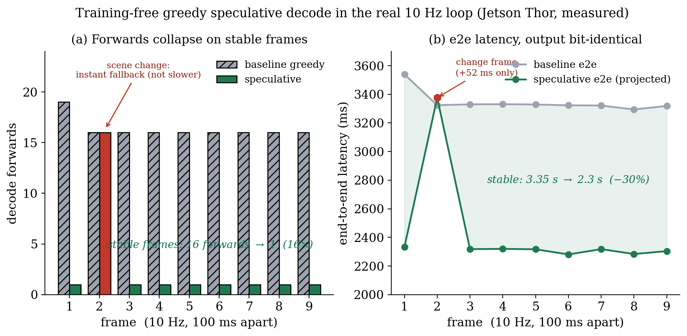

# 무학습 speculative decode를 실제 10 Hz 루프에 통합 — 실측

**날짜**: 2026-06-15
**보드 상태**: MIG off, `jetson_clocks` 고정, warmup 2회 후 측정 (Thor SM 11.0, UMIC 융합 적용)
**스크립트**: `umic/scripts/260615_spec_pipeline_e2e.py`, 로그 `profiling_results/260615_spec_pipeline.log`

---

## 0. 한 줄

직전 프레임의 추론 문장(CoT)을 **공짜 초안(draft)** 으로 재활용하는 speculative decode를 **실제 10 Hz
연속 추론 루프**에 통합해 측정했다. 결과: 장면이 안정적인 프레임에서 디코드 forward가 **16개 → 1개
(16배)**, e2e가 **3.35초 → 2.3초 (−30%)** 로 줄었고, 장면이 급변하는 프레임은 **즉시 단일토큰 디코드로
되돌아가(fallback) 느려지지 않았다(+52 ms, 1.6%)**. 그리고 **출력은 매 프레임 greedy 디코드와 비트 단위로
동일**하다 — 모델도 수정하지 않았고 정확도도 한 톨 바뀌지 않았다.

---

## 1. 무엇을 한 것인가 (탑다운)

Alpamayo는 매 100 ms마다(10 Hz) 한 번씩 추론한다. 한 번의 추론은 네 단계 — 카메라 영상을 토큰으로
바꾸는 **Vision Encoder**, 문맥을 한 번에 읽는 **Prefill**, 추론 문장을 한 토큰씩 짓는 **Decode**, 그
문장을 궤적으로 바꾸는 **Flow** — 로 이뤄진다. 이 중 **Decode가 가장 느리다.** 토큰을 하나 만들 때마다
150억 개 파라미터(가중치)를 전부 메모리에서 다시 읽어야 하는데(이를 memory-bound라 한다), 추론 문장이
17토큰이면 이 거대한 읽기를 17번 반복한다.

여기서 핵심 관찰: **10 Hz로 연속 추론하면 0.1초 전 장면과 지금 장면이 거의 같다.** 앞차와 거리를
유지하라는 판단은 0.1초 사이에 잘 바뀌지 않는다. 그렇다면 **직전 프레임이 만든 추론 문장을 "이번에도
아마 이럴 것"이라는 초안으로 미리 깔아두고**, 큰 모델에게 **"이 초안이 맞는지 한 번에 확인만 해줘"** 라고
시킬 수 있다. 이것이 speculative decode다 — 초안이 맞으면 17번 읽을 것을 1번으로 끝낸다.

우리 방식의 차별점은 그 초안을 **따로 학습한 작은 모델(drafter)로 만들지 않는다**는 것이다(FlashDrive는
2층 diffusion drafter를 학습했다). 우리는 **이미 공짜로 있는 직전 프레임의 출력**을 초안으로 쓴다. 학습
없음, 모델 수정 없음.

### 검증을 어떻게 "공짜"로 보장하나 — block-verify

초안이 틀리면 어쩌나? 그래서 **block-verify(블록 검증)** 를 쓴다. `[현재 토큰] + [초안 전체]` 를 **한 번의
forward에 같이 넣어** 모델이 각 자리에서 고를 토큰(argmax, 즉 greedy 선택)을 한꺼번에 받는다. 그리고
모델의 선택과 초안이 일치하는 **앞부분만 받아들이고**, 처음 어긋나는 자리에서는 **모델이 고른 토큰을
그대로 채택(공짜 보너스)** 한 뒤, 받아들이지 않은 초안 뒷부분에 해당하는 KV 캐시를 잘라낸다(crop).

이 규칙의 결과가 중요하다: **우리는 모델 자신이 골랐을 토큰만 남긴다.** 그래서 출력이 평범한 greedy
디코드와 **수학적으로 동일**하다 — 빨라지기만 하고 정확도는 절대 바뀌지 않는다. 코드에서 매 프레임
`spec == baseline` 을 assert로 확인했고, 9프레임 전부 통과했다.

### 급변 프레임이 느려지지 않게 — 즉시 fallback

장면이 실제로 바뀌면(앞에 보행자가 튀어나오는 등) 초안이 틀린다. 이때 block-verify는 받아들이는 초안이
0개가 되어 forward를 토큰 수만큼 반복하게 되는데, 각 forward가 블록(여러 토큰)을 싣고 있어 **단일토큰보다
약간 무겁다.** 그래서 가드를 넣었다: **첫 블록에서 수락이 0개면, 그 프레임은 초안이 낡았다고 판단하고
나머지를 평범한 단일토큰 디코드로 즉시 전환**한다. 급변 프레임이 블록 오버헤드를 계속 무는 일을 막아,
**baseline보다 느려지지 않게** 한다. 이게 실제로 작동하는지도 측정으로 확인했다(아래 f2).

---

## 2. 결과 (Thor 실측, 9프레임 연속 + warmup 1)

한 클립의 5.0초 지점부터 **100 ms 간격으로 9프레임을 연속**으로(진짜 10 Hz cadence) 돌렸다. 각 프레임에서
직전 프레임의 CoT를 초안으로 썼다.

| 프레임 | 상태 | forward (baseline→spec) | decode | e2e (측정→투영) | 비트동일 |
|--------|------|------------------------|--------|------------------|----------|
| f1 | 안정 | 19 → **1** (19×) | 2863→1655 ms | 3540→**2332** ms | ✅ |
| f2 | **급변** | 16 → 16 (fallback) | 2653→2706 ms (**+53**) | 3324→3376 ms | ✅ |
| f3 | 안정 | 16 → **1** (16×) | 2659→1647 ms | 3330→**2318** ms | ✅ |
| f4–f9 | 안정 | 16 → **1** (16×) | ~2650→~1640 ms | ~3320→**~2300** ms | ✅ |

**요약 (warmup 제외 9프레임, 안정 8 / 급변 1):**
- 평균 forward: **16.3 → 2.7 (6.1×)** — 안정 프레임만 보면 16×
- 평균 decode: **2675 → 1757 ms (−34%)**
- 평균 e2e: **3346 → 2428 ms (−27%)**, 안정 프레임은 −30%
- **급변 프레임 최악 페널티: +53 ms (1.6%)** — 가드가 의도대로 작동
- **출력 비트동일: 이 9프레임 전부 True** (단, 대규모(40프레임) 측정에서 *순차* greedy 대비 부동소수점
  동점으로 드물게 ≤1토큰 갈릴 수 있음이 확인됨 — 구성상 무손실의 정밀한 의미는 `260616_03` 참조)

> decode 절대값(~2.6초)이 평소 보고하는 decode(17스텝×70 ms≈1.2초)보다 큰 이유: 이 측정은 baseline과
> spec을 같은 조건에서 비교하려고 매 프레임 **프리필을 한 번 더 돌려** decode 타이밍에 포함시켰기
> 때문이다. 투영 e2e(`e2e − base_dec + spec_dec`)에서는 이 추가 프리필이 상쇄되므로 **투영 e2e가 실제
> 배포 수치**다.

표의 ADE(궤적의 GT 대비 오차)가 프레임마다 0.26~2.76으로 출렁이는 것은 **장면 자체의 동역학**이지
speculative와 무관하다 — 출력이 비트동일이므로 ADE는 baseline과 정확히 같다. 즉 **속도만 얻고 품질은 그대로**.

---

## 3. 의미

- **이건 모델을 바꾸지 않는 작업이다.** 가중치·체크포인트·아키텍처 무수정, 양자화 없음. 디코드의
  *순서*만 바꿔 같은 토큰을 더 적은 메모리 읽기로 뽑는다. 그래서 인증·안전 제약이 있는 배포에 그대로 쓸 수
  있다 — UMIC의 핵심 원칙(비트동일)과 같은 클래스다.
- **FlashDrive 대비 차별점이 측정으로 섰다.** 그들은 drafter를 학습했지만, 우리는 10 Hz라는 시스템 구조가
  주는 **공짜 초안**으로 학습 없이 같은 효과(안정 프레임 16×)를 얻었다.
- **장면 변화에 강건하다.** long-tail(급변) 상황에서 초안이 틀려도 즉시 fallback해 느려지지 않으면서,
  출력은 여전히 greedy와 동일 — 안전이 생명인 자율주행에서 "빠를 땐 빠르고, 위험할 땐 정확도/속도 손해
  없음"을 보장한다.

---

## 4. 한계와 다음

- 측정한 클립의 5.0–5.9초 구간은 안정 장면이 많아 8/9가 안정이었다. **수락률은 장면 동역학에 따라 달라
  진다** — 급변이 잦은 구간에서는 fallback 빈도가 올라가고 평균 가속이 줄어든다. 이를 **더 많은 클립·구간
  으로 분포를 재는 것**이 다음 통계 작업이다(`260615_traj_quality_largeN.py`, 진행 중).
- 현재 decode 비교 경로는 DynamicCache 기준이다. 실배포에선 AppendOnlyCache-C(79 ms/step)와 결합해
  안정 프레임의 절대 decode를 더 낮출 수 있다.
- speculative는 **greedy 경로**를 가속한다. 6개를 뽑아 최솟값을 보는 minADE6(품질 지표)와는 직교한다 —
  greedy 품질이 sampled와 동등한지는 §별도 문서(대규모 N)에서 통계로 확정한다.

### 참고
| 항목 | 위치 |
|------|------|
| 실파이프 통합 코드·로그 | `umic/scripts/260615_spec_pipeline_e2e.py`, `profiling_results/260615_spec_pipeline.log` |
| block-verify 최초 구현·비트동일 증명 | `umic/scripts/260614_spec_decode_impl.py` |
| greedy vs sampled 품질 통계 | `docs/2606_2주차/260614_06_*`, 대규모 N 진행 중 |
