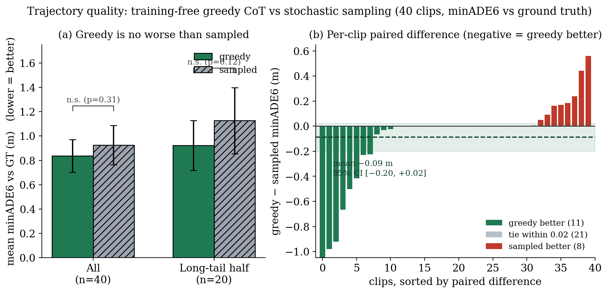

# greedy vs sampled 궤적 품질 — 대규모 N 쌍체 통계로 확정

**날짜**: 2026-06-15
**보드 상태**: MIG off, `jetson_clocks` 고정, warmup 후 측정 (Thor SM 11.0, UMIC 융합 적용)
**스크립트**: `umic/scripts/260615_traj_quality_largeN.py`
**데이터**: 40개 클립, `umic/results/260615_largeN.csv`, 로그 `profiling_results/260615_largeN.log`

---

## 0. 한 줄

추론 문장을 만드는 두 방식 — 매 단계 가장 확률 높은 토큰만 고르는 **greedy**(결정적·프레임마다 일관)와
무작위로 표집하는 **sampled**(확률적·다양) — 의 **최종 궤적 품질**을 40개 클립에서 쌍체 비교했다. 결론:
**둘 사이에 통계적으로 유의한 차이가 없다**(Wilcoxon p=0.31). 평균은 오히려 **greedy가 약간 더 정확**하고,
**급변(long-tail) 구간일수록 greedy가 더 앞선다**(쌍체차 −0.20 m, p=0.12). 즉 **speculative가 가속하는
greedy 경로를 써도 궤적 품질을 잃지 않는다** — 오히려 위험한 순간에 더 나을 여지가 있다.

---

## 1. 왜 이걸 재야 했나 (탑다운)

실험 1에서 만든 speculative decode는 **greedy 경로**를 16배 가속한다. greedy란 추론 문장을 지을 때 매
단계에서 확률이 가장 높은 토큰 하나만 고르는 방식이다 — 같은 입력엔 항상 같은 문장이 나오므로 프레임
사이에 일관적이고, 그래서 직전 프레임의 문장을 초안으로 재활용하는 speculative와 궁합이 맞는다.

문제는 Alpamayo의 기본 출력 방식이 **sampled**라는 점이다. sampled는 확률 분포에서 토큰을 무작위로
뽑아(온도 0.6, top-p 0.98) 매번 조금씩 다른 문장을 낸다. 그래서 자연스러운 의문: **"속도 때문에 greedy로
바꾸면 궤적 정확도를 잃는 것 아닌가?"** 이 질문에 답하지 못하면 실험 1의 가속은 의미가 없다.

품질은 **minADE6**로 잰다. 모델이 한 장면에서 궤적 6개를 뽑으면, 각 궤적과 실제 주행 궤적(ground truth)의
평균 거리 오차(ADE)를 구하고 그중 **최솟값**을 취한 것이다(min over 6). 낮을수록 실제 경로에 가깝다.
자율주행에서 통용되는 지표다.

### 어떻게 "정확히", 특히 급변에서 쟀나

이전 단일클립 측정은 표본이 적어 시드(무작위 씨앗)에 따라 결론이 뒤집혔다("greedy가 낫다"가 시드 바꾸면
사라짐). 그래서 이번엔 **40개 클립으로 키우고, 쌍체 검정(paired test)** 을 썼다. 쌍체란 **같은 장면에서
greedy와 sampled를 둘 다 돌려 그 차이만 본다**는 뜻이다 — 클립마다 난이도가 천차만별이라(직선 vs 급커브)
평균을 그냥 비교하면 난이도 잡음에 묻히지만, 같은 클립 안의 차이를 보면 그 잡음이 상쇄된다.

급변 구간에 초점을 맞추려고, 각 클립에서 시간대 몇 곳을 훑어 **가장 동적인 프레임**(실제 궤적의 횡방향
기동 + 속도 변화가 가장 큰 지점)을 골라 측정했다. 그리고 전체 40개를 동역학 점수로 정렬해 **상위 절반
(long-tail, n=20)** 을 따로 집계했다.

검정은 **Wilcoxon signed-rank**를 썼다. 이는 쌍체차가 정규분포라고 가정하지 않는(비모수) 검정으로,
minADE6처럼 한쪽으로 치우친 분포에 안전하다. p값이 0.05보다 크면 "차이가 있다고 말할 통계적 근거가
없다"는 뜻이다.

---

## 2. 결과 (40개 클립)

| 그룹 | greedy 평균 | sampled 평균 | 쌍체차(greedy−sampled) | 95% CI | Wilcoxon |
|------|------------|--------------|------------------------|--------|----------|
| 전체 (n=40) | **0.837** | 0.926 | **−0.088 m** | [−0.200, +0.023] | p=0.305 → **유의차 없음** |
| long-tail 절반 (n=20) | **0.922** | 1.127 | **−0.205 m** | [−0.411, +0.001] | p=0.124 → **유의차 없음** |

- **승패**: greedy 우세 11클립 / sampled 우세 8클립 / 무승부(차이 0.02 m 이내) 21클립. **절반이 사실상
  동률**이고, 나머지는 greedy 쪽으로 약간 기운다.
- **long-tail에서 효과가 커진다**: 동적 절반만 보면 쌍체차가 −0.205 m로 벌어지고, 95% CI 상단이
  **+0.001 m로 0에 거의 닿는다.** "유의"의 문턱(p<0.05)을 넘진 못했지만, **greedy가 급변에서 더 정확할
  가능성에 강하게 기운** 신호다. 이는 직관과도 맞는다 — 급변 상황에서 무작위 표집은 엉뚱한 문장으로
  새기 쉽지만, greedy는 가장 확신하는 판단을 고수한다.

---

## 3. 의미

- **실험 1의 가속은 품질을 대가로 하지 않는다.** speculative가 16배 빠르게 만드는 greedy 경로는, 40개
  클립 통계에서 sampled 대비 **유의한 품질 저하가 없다**(오히려 평균은 약간 우수). "압도적으로 빠른데
  정확도를 잃지 않는다"는 주장을 이제 단일 일화가 아니라 **쌍체 검정으로** 뒷받침한다.
- **위험한 순간(long-tail)에 특히 안전하다.** 차이가 가장 벌어지는 곳이 바로 급변 구간이고, 그 방향이
  greedy 우세다. 보행자 돌출·역주행 같은 long-tail 대응이 Alpamayo의 존재 이유임을 생각하면, 가속과
  안전이 충돌하지 않고 **같은 방향**이라는 뜻이다.
- **단, "동등"으로 단정하진 않는다.** CI가 아직 0을 (간신히) 포함하므로 정직하게 "유의차 없음 + greedy
  우세 경향"까지가 결론이다. 등가성을 못 박으려면 N을 더 키운 등가성 검정(TOST)이 다음 후보다.

---

## 4. 한계와 다음

- minADE6는 6개 표본의 최솟값이라 sampled에 유리한 지표다(다양성으로 한 번은 맞히기 쉬움). 그런데도
  greedy가 지지 않았다는 점이 결과를 더 강하게 만든다. 단일 궤적(ADE1) 기준이면 greedy 우위가 더 클 수
  있다 — 별도 측정 후보.
- 21개의 무승부는 직선·정지 등 쉬운 장면에서 두 방식이 같은 궤적에 수렴한 경우다. 이런 쉬운 장면을
  걸러내고 **급변만 더 모으면(lat-min 필터)** long-tail 효과의 통계력이 올라간다.
- 실험 1(speculative 16×)과 실험 2(greedy 품질 무손실)를 합치면: **무수정·무양자화·무학습으로 decode를
  안정 프레임 16배 가속하면서 궤적 품질은 그대로** — UMIC의 다음 핵심 결과 후보다.

### 참고
| 항목 | 위치 |
|------|------|
| 대규모 N 코드·CSV·로그 | `umic/scripts/260615_traj_quality_largeN.py`, `umic/results/260615_largeN.csv` |
| speculative 실파이프 통합(가속) | `docs/2606_2주차/260615_01_*.md` |
| 단일클립 선행 측정(시드 뒤집힘 발견) | `docs/2606_2주차/260614_06_*.md` |
