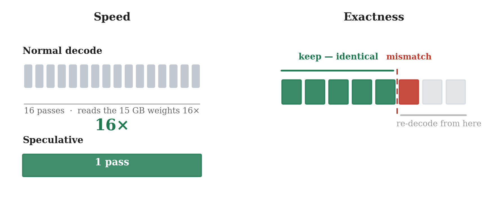

# Block-verify speculative decode — 메커니즘 상세와 관련 연구

**날짜**: 2026-06-16
**목적**: 실험 1(`260615_01`)에서 쓴 무학습 speculative decode가 **어떻게 한 번의 forward로 여러 토큰을
한꺼번에 검증하면서도 출력이 비트동일한지**를 끝까지 풀어 적는다. 그리고 같은 메커니즘을 쓴 선행 연구를
정리해 우리의 위치를 분명히 한다.
**구현 근거**: `umic/scripts/260614_spec_decode_impl.py` (`block_forward`, `decode_spec`),
`umic/scripts/260615_spec_pipeline_e2e.py` (`decode_spec_guarded`).

---

## 0. 한 줄

언어 모델은 원래 **한 번의 forward에서 입력의 모든 위치마다 "다음 토큰"을 동시에 계산**한다. 보통
디코드는 맨 끝 하나만 쓰고 나머지를 버리지만, speculative decode는 **직전 프레임의 문장을 미래 토큰의
추측으로 미리 채워 넣어** 그 버려지던 예측들을 **검증에 활용**한다. 모델의 예측과 추측이 앞에서부터 맞는
**연속 구간(prefix)만** 받아들이고 첫 어긋남에서 끊으므로, 출력은 평범한 greedy 디코드와 **글자 하나까지
동일**하다. decode가 가중치 읽기에 묶인(memory-bound) 단계라 **25개 추측 검증 비용이 1토큰 생성과 거의
같아** 공짜에 가깝다.

---

## 1. 출발점 — decode는 왜 느린가 (탑다운)

Alpamayo는 매 추론에서 짧은 추론 문장(CoT, 약 17토큰)을 한 토큰씩 짓는다. 이 단계가 느린 이유는 토큰
하나를 만들 때마다 **150억 개 파라미터(약 15 GB)를 메모리에서 전부 다시 읽어야** 하기 때문이다. 연산량이
아니라 **메모리 대역폭이 병목**이라는 뜻이고(memory-bound), 그래서 17토큰이면 이 거대한 읽기를 17번
반복한다. Thor의 LPDDR5X 231 GB/s에서 이 반복이 decode 시간의 대부분을 차지한다.

여기서 핵심 관찰 두 가지가 가속의 토대가 된다.

1. **10 Hz로 연속 추론하면 0.1초 전과 지금 장면이 거의 같다.** "앞차와 거리를 유지하라" 같은 판단은
   0.1초 사이에 잘 바뀌지 않는다 → 직전 프레임의 문장이 이번 문장의 **좋은 추측**이 된다.
2. **모델의 forward는 토큰 수가 늘어도 가중치를 한 번만 읽는다.** memory-bound라 1토큰을 처리하든
   25토큰을 처리하든 가중치 읽기는 동일 → **여러 토큰을 한꺼번에 처리하는 게 거의 공짜**다.

이 둘을 합치면: *직전 문장을 추측으로 미리 깔아두고, 한 번의 forward로 한꺼번에 검증한다.*



---

## 2. 메커니즘 — 한 번의 forward가 어떻게 "여러 위치"를 동시에 예측하나

이게 첫 번째 핵심 질문이다. 답은 transformer가 학습된 방식 그 자체에 있다.

길이 L짜리 토큰열을 모델에 넣으면, 모델은 **각 위치마다 hidden state를 하나씩** 만들고, 맨 끝의 출력층
(LM head)이 그 각각을 어휘 전체에 대한 확률분포로 바꾼다. 즉 출력은 **`[L, 어휘크기]` 모양의 행렬** —
**모든 입력 위치에 대해 "이 위치 다음에 올 토큰"의 예측이 한꺼번에** 들어 있다. (모델을 훈련할 때 문장
전체를 넣고 위치마다 다음 토큰을 맞히게 하는 teacher forcing이 바로 이 구조다.)

보통 디코드는 미래 토큰을 모르니 토큰 1개만 넣고 **맨 끝 위치의 예측 1개만** 쓰고 나머지를 버린다. 그런데
우리가 미래 토큰을 **추측해서 미리 채워 넣으면**, 그 버려지던 위치별 예측들이 전부 의미를 갖는다.

예를 들어 입력으로 `[cur, d1, d2, d3, d4]`를 넣으면(`cur`은 직전에 확정된 토큰, `d*`는 직전 프레임에서 가져온
추측), 출력 logits `[5, vocab]`의 각 행을 argmax한 예측 배열은:

```
preds[0] = cur 다음 예측           → d1 과 비교
preds[1] = (cur, d1) 다음 예측      → d2 와 비교
preds[2] = (cur, d1, d2) 다음 예측  → d3 와 비교
preds[3] = (cur, d1, d2, d3) 다음   → d4 와 비교
preds[4] = (… d4) 다음 예측         → 다음 추측과 비교
```

비교는 모델이 하는 게 아니다. **모델은 위치별 예측을 한 번에 뱉을 뿐이고, 일치 판정은 우리가 사후에 두
배열을 인덱스 맞춰 훑어** 한다. 출력이 이미 위치 순서대로 정렬돼 있으니 `preds[i]`와 `draft[i+1]`을 차례로
비교하면 된다. 실제 코드도 딱 이렇다 (`260614_spec_decode_impl.py`):

```python
logits = block_forward(...)          # 한 번의 forward → [g, vocab]
preds  = logits.argmax(-1).tolist()  # 위치마다 예측을 한꺼번에
a = 0
while a < ndraft and draft[j + a] == preds[a]:   # 앞에서부터 일치하는 만큼
    a += 1                                        # 첫 불일치에서 멈춤
bonus = preds[a]                     # 어긋난 자리엔 모델 자신의 선택을 채택
```

> **"한 번에 비교"의 정체**: 비싼 부분(가중치 15 GB 읽기)은 단 한 번의 forward에서 끝나고, 그 forward가
> L개 예측을 통째로 만들어 준다. 그 다음 비교는 CPU에서 배열 두 개를 나란히 훑는 **거의 공짜 연산**이다.

---

## 3. 왜 "맞은 만큼만" 확정해도 안전한가 (그리고 중간부터 어긋나는 경우)

두 번째 핵심 질문: *첫 토큰은 맞는데 그 다음부터 달라질 수도 있잖아? 어떻게 확정하나?* 맞다. 그리고
알고리즘은 정확히 그 상황을 처리한다. "첫 토큰이 맞으면 전체가 맞다"고 **절대 가정하지 않는다.** 규칙은
하나다:

> **앞에서부터 일치하는 연속 구간(prefix)만 받아들이고, 처음 어긋나는 지점에서 끊는다.**

추측이 `Keep · distance · to · lead · vehicle`인데, 이번 장면이 살짝 달라져 모델은
`Keep · distance · to · the · …`를 원한다고 하자:

| 위치 | 추측(draft) | 모델 예측 | 판정 |
|------|------------|-----------|------|
| 1 | Keep | Keep | ✓ 수락 |
| 2 | distance | distance | ✓ 수락 |
| 3 | to | to | ✓ 수락 |
| 4 | lead | **the** | ✗ **첫 불일치** |
| 5 | vehicle | (무시·폐기) | — |

→ 앞의 3개(`Keep distance to`)만 받아들이고, 4번 자리엔 **모델 자신이 고른 `the`를 공짜 보너스로 채택**한
뒤, 받아들이지 않은 추측의 KV 캐시를 잘라내고(crop) 거기서부터 다시 디코드한다. **전부 수락도 전부 거부도
아닌, 부분 수락**이 일반적인 경우다.

**받아들인 prefix는 왜 비트동일이 보장되나?** causal attention(인과적 주의) 때문이다.

- 위치 4의 예측은 **`[cur, Keep, distance, to]`를 진짜 입력이라고 가정하고** 만들어졌다. causal mask가
  위치 4로 하여금 그 앞만 보게 하기 때문이다.
- 그런데 Keep·distance·to가 모두 일치했으니 **그 가정이 실제로 참**이다. → 위치 4의 예측은 "정상 디코드로
  `to`까지 만든 뒤 내놨을 바로 그 토큰"과 **동일**하다. 그래서 이 비교는 유효하고, 수락한 토큰은 모델이
  스스로 골랐을 토큰과 같다.
- 반대로 **불일치 이후(위치 5)는 틀린 토큰(`lead`)을 가정하고 계산**됐다. 문맥이 오염됐으니 예측도 신뢰할
  수 없다 → **버린다.**

즉 검증은 **왼쪽에서 오른쪽으로 사슬처럼 이어지다 첫 불일치에서 끊긴다.** 끊긴 뒤는 신뢰하지 않으므로
잘못 확정될 일이 없다. 우리는 **모델 자신이 골랐을 토큰만 남긴다.** 그래서 안정·급변·부분일치 어느 경우든
출력이 평범한 greedy 디코드와 **글자 하나까지 동일**하다 — 정확히는 **같은 forward 경로로 계산한** greedy와
동일하다(구성상 무손실). 코드에서 매 프레임 `spec == baseline`을 assert로 확인했고 9프레임 전부 통과했다
(`260615_01`).

> 정밀화: *순차*(한 토큰씩) greedy를 기준으로 삼으면, 모델이 무차별인 **부동소수점 동점** 토큰에서 batched↔
> sequential 차이로 드물게 ≤1토큰 갈릴 수 있다(대규모 40프레임 중 3프레임, logit 격차 ≤0.06). 이는 알고리즘
> 손실이 아니라 bf16 배치 연산의 산물이다 — 상세는 `260616_03`.

---

## 4. 급변 상황을 어떻게 "인지"하나 — 별도 감지기가 없다

세 번째 질문: *갑자기 바뀌는 long-tail 상황은 어떻게 인지하나?* 답: **인지하는 분류기나 임계값이 전혀
없다.** 그냥 추측을 한 번 시도해 보고, **불일치가 일어났다는 사실 자체가 곧 감지**다.

- 장면이 그대로면 모델 예측이 추측과 줄줄이 일치한다(prefix가 길다) → 16배 가속.
- 장면이 바뀌면(보행자 돌출 등) 모델 예측이 추측과 **이른 위치에서 어긋난다**(prefix가 짧거나 0) → 수락이
  거의 없다.
- 즉 **모델이 낡은 추측에 동의하지 않는 순간**이 "이번 장면은 다르다"는 신호다. 외부 장면 변화 탐지기가
  필요 없다. 모델의 불일치가 곧 탐지기다.

실배포에서는 여기에 가드를 하나 더 얹었다(`decode_spec_guarded`): **첫 블록에서 수락이 0이면** 그 프레임은
추측이 낡았다고 보고 **나머지를 평범한 단일토큰 디코드로 즉시 전환(fallback)** 한다. block 검증은 여러 토큰을
싣고 가서 단일토큰보다 살짝 무겁기 때문에, 추측이 완전히 빗나간 프레임이 그 오버헤드를 계속 무는 걸 막는다.
실측에서 급변 프레임의 추가 비용은 **+53 ms(1.6%)** 에 그쳤다 — baseline보다 느려지지 않는다.

| | 안정 프레임 | 급변 프레임 |
|---|---|---|
| 직전 토큰 재사용 | 거의 다 일치 → **재사용 O** | 이른 위치에서 불일치 → **재사용 X** |
| 속도 | forward 16 → 1 (16×) | 원래 속도(+1.6%) |
| 정확도 | 비트동일 | 비트동일 |
| "감지" | 추측이 맞음 | **추측이 틀림 = 자동 감지** |

비유하면, **지난번 답안을 베껴 와 선생님께 한 번에 채점받는** 것이다. 맞으면 16문제를 1번 채점으로 끝내고
(빠름), 틀리면 그 문제부터 다시 제대로 푼다(원래 속도). 어느 경우든 **최종 답안은 직접 푼 것과 글자 하나까지
같다.**

---

## 5. 같은 메커니즘을 쓴 관련 연구

이 메커니즘은 우리가 발명한 게 아니다. 핵심 검증 원리는 잘 정립돼 있고, 우리의 가치는 **그 원리를 무학습·
무수정으로, 10 Hz VLA의 시간적 구조(직전 프레임)에 맞춰 iGPU에서 실증**한 데 있다. 계보를 셋으로 나눈다.

> ⚠ 아래 연도·학회 표기는 인용 전에 원문으로 한 번 더 확인할 것(기억 기반 정리).

### (A) 검증의 뿌리 — "여러 토큰을 한 번에 검증하고 일치 prefix를 받는다"

- **Blockwise Parallel Decoding** (Stern, Shazeer, Uszkoreit, *NeurIPS 2018*). 보조 헤드로 미래 여러 토큰을
  한꺼번에 예측한 뒤 **본 모델로 검증해 가장 긴 일치 prefix를 채택**한다. **우리 block-verify의 직접 조상.**
- **Fast Inference from Transformers via Speculative Decoding** (Leviathan, Kalman, Matias, *ICML 2023*).
  작은 draft 모델이 제안하고 큰 모델이 **병렬로 한 번에 검증**한다. greedy 버전은 **출력이 정확히 동일**
  하다는 점을 형식화 — 우리의 "비트동일"이 여기서 온다.
- **Accelerating LLM Decoding with Speculative Sampling** (Chen et al., DeepMind, 2023). 표집(sampled)
  경우에도 **수정된 기각 표집(rejection sampling)으로 목표 분포를 보존**하는 법을 제시. 우리 실험에서
  sampled-speculative가 break-even이었던 이유의 이론적 배경.

### (B) 무학습 draft — "별도 모델 없이 이미 있는 토큰을 추측으로"  ← 우리와 같은 계열

- **Inference with Reference (LLMA)** (Yang et al., 2023). 참조 문서/문맥에서 **구간을 그대로 복사해 draft**로
  쓰는 무학습·무손실 가속. "이미 있는 토큰을 재활용"이라는 점에서 우리와 가장 가깝다.
- **Prompt Lookup Decoding** (Saxena, 2023, 오픈소스). 프롬프트 안의 **n-gram 일치를 draft**로 쓴다.
  학습 불필요, 입력에 근거가 있는 작업에서 강력.
- **Lookahead Decoding** (Fu et al., *ICML 2024*). Jacobi 반복 + n-gram 풀로 **draft 모델 없이** 병렬화.
- **Self-Speculative Decoding (Draft & Verify)** (Zhang et al., *ACL 2024*). 같은 모델이 **자기 레이어를
  건너뛰어** 스스로 draft를 만든다. 추가 모델 없음.

**우리의 차이**: draft의 출처가 프롬프트/문서/자기레이어가 아니라 **직전 프레임의 출력(100 ms 전 CoT)** 이다.
prompt-lookup의 *시간적(temporal)* 버전이라 볼 수 있고, **10 Hz VLA에서 프레임 간 출력 재사용을 draft로
쓰는 speculative**는 (조사 범위 내에서) 선행 사례를 찾지 못했다 — **우리 연구의 신규성 후보**다. 단, 검증
메커니즘 자체는 (A)의 표준임을 분명히 한다.

### (C) 학습된 draft — 우리가 일부러 피한 방향(대조군)

- **Medusa** (Cai et al., 2024). 추가 디코딩 헤드 + 트리 어텐션으로 여러 후보를 병렬 검증. **헤드 학습 필요.**
- **EAGLE / EAGLE-2** (Li et al., *ICML 2024*). feature 수준에서 자기회귀로 draft. **학습 필요.**
- **SpecInfer** (Miao et al., *ASPLOS 2024*). 토큰 트리로 여러 draft를 동시에 검증하는 서빙 시스템.
- **FlashDrive** (우리가 비교 중인 VLA 논문). 2층 diffusion **drafter(DFlash)를 학습**해 decode 4.3× 가속.
  우리는 같은 효과(안정 프레임 16×)를 **학습 없이** 얻는다는 점이 핵심 대조.

### (D) 같은 도메인의 2026년 최신 연구 (축자 초록으로 직접 확인함)

자율주행 VLA의 추론 가속은 2026년 현재 **매우 활발한 주제**다. 우리와 가장 가까운 네 편을 직접 읽어
정확히 무엇을 하는지 확인했다.

- **FastDriveCoT** (Gu, Wang, Chen, … Ivanovic, Pavone — **NVIDIA Alpamayo 팀**, 2026-02, arXiv 2602.02864).
  CoT를 **하위 작업들의 의존성 그래프로 분해**해 서로 독립인 단계(예: 핵심 객체 식별, 교통 규칙 요약)를
  **한 번의 forward에서 병렬 생성**한다. 무학습, downstream 성능 보존, CoT 생성 3–4× 가속.
  → **프레임 내 "구조축" 병렬화.** 직전 프레임을 쓰지 않으며 speculative draft도 아니다.
- **SV-VLA: Speculative Verification for VLA Control** (Wang et al., 2026-04, arXiv 2604.02965). 무거운 VLA를
  **저빈도 macro-planner**로 두어 action chunk를 만들고, **경량 verifier가 최신 관측으로 감시하다 필요할
  때만 replanning**을 트리거한다. → **action 청크 수준**의 speculative이지 언어 토큰 block-verify가 아니다.
  로봇 manipulation 대상, 별도 verifier 필요.
- **MMSpec** (Shen et al., 2026-03, arXiv 2603.14989). VLM용 speculative decoding 최초 벤치마크(10개 기법).
  핵심 발견: **"텍스트 LLM용 기법은 멀티모달에서 성능이 떨어진다"**, throughput≠latency. → 일반적 무학습
  speculative가 VLM에서 약하다는 **우리 결과의 견제이자 반례 배경**.
- **SPECVLM** (EMNLP 2025). Video LLM용 speculative — target이 video token pruning을 유도하고 **draft
  모델**이 speculation. → 영상 이해용, draft 모델 기반(무학습·무모델 아님).

---

## 6. 다른 논문 대비 차별점과 아이디어의 정확한 위치 (정직한 판정)

사용자 요청대로 **"아무도 안 한 내용인가, 논문화 가능한가"** 를 과장 없이 적는다. 위 (A)~(D)를 직접 읽고
내린 결론이다.

### 6.1 우리 아이디어의 두 좌표 — 시간축 × 무수정

우리를 정확히 규정하는 두 축:

1. **중복의 축이 "시간(프레임 간)"이다.** decode를 가속하려면 어딘가에 중복(예측 가능성)이 있어야 한다.
   - prompt-lookup/LLMA는 *문맥 내(공간적)* 중복을 쓴다 (입력에 이미 있는 토큰 복사).
   - **FastDriveCoT는 *구조적* 중복을 쓴다** (CoT 템플릿의 독립 하위작업 병렬).
   - **우리는 *시간적* 중복을 쓴다** (10 Hz라 직전 프레임 CoT가 거의 그대로 재현). ← 이 축이 우리 고유.
2. **모델 무수정·무학습·무양자화 + 출력 비트동일.** FlashDrive(drafter 학습·양자화), Medusa/EAGLE(헤드
   학습), SV-VLA(별도 verifier)와 달리 우리는 **forward만 교체**하고 출력이 greedy와 글자까지 같다.

> **핵심 한 줄**: FastDriveCoT가 "한 프레임의 CoT를 **옆으로**(구조적으로) 쪼개 병렬화"한다면, 우리는
> "**시간으로**(프레임 간) 앞 답을 빌려와 병렬 검증"한다. **두 축은 직교하며 합쳐질 수 있다** — 한 프레임
> 안에서 구조 병렬 + 프레임 사이 시간 speculative.

### 6.2 "아무도 안 했나?" — 정직한 답: 그 *정확한 조합*은 못 찾았다. 단, 인접 연구가 빽빽하다.

- **언어 토큰 수준에서, 직전 프레임 CoT를 draft로 쓰는 무학습 block-verify를 VLA에 적용**한 선행은
  조사 범위(arXiv 2026-06까지 검색)에서 **찾지 못했다.** SV-VLA는 action 수준, FastDriveCoT는 구조 병렬,
  SPECVLM은 draft 모델 기반 — **메커니즘이 모두 다르다.**
- 그러나 **"AV CoT를 무학습으로 가속한다"는 문제의식 자체는 이미 점유**돼 있다(FastDriveCoT, 그것도
  NVIDIA Alpamayo 팀). "speculative for VLA"라는 이름도 SV-VLA가 (다른 수준에서) 선점했다.
- 따라서 정확한 위치는 **"빈 땅의 발견"이 아니라 "붐비는 골목의 빈 좌표"** 다 — *시간축 × 언어토큰 ×
  무수정 비트동일 × 엣지 iGPU 실측* 의 교차점. 좁지만 비어 있다.

### 6.3 "논문화 가능한가?" — 단독 알고리즘으론 약함, 시스템 기여로는 충분.

- **단독 "새 디코딩 기법"으로는 부족하다.** 검증 메커니즘은 Stern(2018)·Leviathan(2023) 표준이고,
  "직전 출력을 draft로"는 prompt-lookup의 시간 버전이라 reviewer가 *incremental*로 볼 위험이 크다.
- **그러나 시스템/엣지 추론 기여로는 설득력이 있다.** 발표 단위를 *temporal speculative 단독*이 아니라
  **UMIC 전체**(무수정·무양자화 융합 + adaptive flow + temporal speculative)로 묶고, 다음을 근거로:
  1. **직교성·합성 가능성**: FastDriveCoT(구조축)와 우리(시간축)는 곱해질 수 있음을 측정으로 보이면 강함.
  2. **MMSpec의 "무학습 spec은 VLM에서 약하다"에 대한 반례**: 일반 PLD/n-gram이 아니라 *시간적* draft가
     장면 안정 구간에서 16× 수락을 내는 조건을 규명 (왜 시간 draft가 문맥 draft보다 센가).
  3. **엄밀한 엣지 실측**: 비트동일 증명, memory-bound 하한 분석, fallback 가드로 급변 프레임 무손해,
     greedy≈sampled 품질 통계(n=40, 쌍체). 시스템 논문이 요구하는 측정 규율을 갖췄다.
  4. **재현성·무수정 원칙**: 인증·안전 제약(양자화·파인튜닝 불가) 하의 가속이라는 *실배포 제약*이 동기.
- **권장 프레이밍/장소**: 엣지·시스템 추론 트랙(MLSys/ASPLOS 인접) 또는 AV 워크숍. 핵심 주장은
  *"production VLA를 무수정으로 엣지 iGPU에서 가속하는 측정 기반 방법론, 그 안에서 직교하는 중복 축들
  (구조·시간)을 조합"* — temporal speculative는 그 검증된 한 구성요소.

### 6.4 정직한 리스크

- **선점 위험**: FastDriveCoT가 NVIDIA Alpamayo 팀이라, 같은 팀이 시간축 speculative로 확장할 동기·접근성이
  크다. 속도가 관건.
- **수치 과장 금지**: "16×"는 *안정 프레임의 forward 수* 기준이다. 정직한 집계는 평균 forward 6.1×,
  decode −34%, e2e −27%이고 급변 프레임은 이득이 없다. MMSpec의 "throughput≠latency" 경고대로 평균으로
  말해야 한다.

---

## 7. 정리 — 우리의 위치

- **메커니즘은 표준, 기여는 제약과 맥락이다.** block-verify·일치 prefix 채택은 Stern(2018)·Leviathan(2023)
  의 정립된 원리다. 우리는 이를 **무학습·무수정·무양자화**로 묶고, **10 Hz VLA의 직전 프레임을 draft**로
  쓰는 시간적 재사용으로 iGPU(Thor)에서 실증했다.
- **draft의 출처가 "시간(프레임 간)"이라는 좌표가 우리 고유**다. 다만 §6의 정직한 판정대로 *빈 땅*이 아니라
  *붐비는 골목의 빈 좌표*이며, **단독 알고리즘이 아니라 UMIC 시스템 기여**로 논문화하는 게 맞다 (구조축
  FastDriveCoT와의 직교·합성, MMSpec 반례, 엣지 비트동일 실측).
- 다음: ① FastDriveCoT(구조축) + 우리(시간축) **합성 시 곱셈적 이득** 측정, ② 왜 *시간* draft가 *문맥*
  draft보다 센지 규명, ③ sampled 경로 분포 보존(Chen 2023)이 break-even을 넘는 조건, ④ fallback 임계의
  장면 동역학 적응.

### 참고
| 항목 | 위치 |
|------|------|
| 메커니즘 구현 | `umic/scripts/260614_spec_decode_impl.py`, `260615_spec_pipeline_e2e.py` |
| 실파이프 통합 결과(16×) | `docs/2606_2주차/260615_01_*.md` |
| greedy 품질 통계 | `docs/2606_2주차/260615_02_*.md` |
| FlashDrive 비교(학습 drafter 대조) | `docs/2606_2주차/260614_02_*.md` |
| FastDriveCoT (구조축 병렬, NVIDIA) | arXiv 2602.02864 |
| SV-VLA (action 수준 speculative) | arXiv 2604.02965 |
| MMSpec (VLM speculative 벤치마크) | arXiv 2603.14989 |
