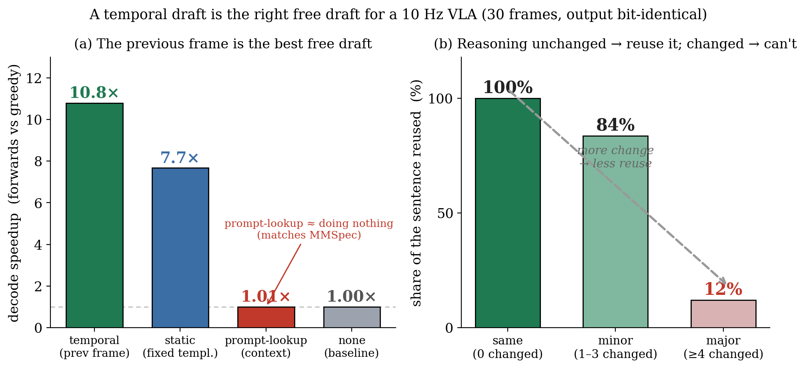

# 왜 *시간* draft가 *문맥* draft를 이기는가 — 출처별 head-to-head (실험 2b)

**날짜**: 2026-06-16
**보드 상태**: MIG off, `jetson_clocks` 고정(1386 MHz 확인), warmup 후 측정 (Thor SM 11.0, UMIC 융합)
**스크립트**: `umic/scripts/260615_draft_source_study.py`, 데이터 `umic/results/260615_draftsrc.csv`

---

## 0. 한 줄

MMSpec(arXiv 2603.14989)은 *"무학습 speculative draft(prompt-lookup·n-gram 등)는 멀티모달에서
힘을 못 쓴다"* 고 보고했다. 우리는 **같은 Alpamayo 프레임**에서 draft 출처만 바꿔 검증했다. 결과:
문맥 기반 draft(prompt-lookup)는 **가속 1.01× = 사실상 0**으로 MMSpec를 그대로 재현하지만, **직전
프레임의 추론 문장을 쓰는 *시간* draft는 10.8×** 로 압도한다. 고정 템플릿(static)은 7.7×지만 장면이
frame-0에서 벗어나면 무너진다. 그리고 **수락량은 프레임 간 CoT 변화량과 −0.72로 상관**한다 — 가속을
미리 예측할 수 있는 법칙이다. 30프레임 × 4출처 **전부 greedy와 비트동일**.

---

## 1. 무엇을 왜 쟀나 (탑다운)

decode를 무학습으로 가속하려면 어딘가에 **예측 가능한 중복**이 있어야 한다. 그 중복을 어디서 길어오느냐
(draft의 출처)가 speculative의 성패를 가른다. MMSpec의 결론은 "문맥(prompt) 안에서 길어오는 일반적
무학습 기법은 VLM에서 약하다"였다. 그렇다면 우리의 *시간적* draft(10 Hz라 직전 프레임 문장이 거의 그대로
재현)는 정말 다른가? 이를 **같은 프레임·같은 검증 방식(block-verify)** 으로 출처만 바꿔 직접 비교했다.

네 가지 출처 (모두 greedy 출력을 한 토큰도 안 바꾸는 block-verify로 검증):

| 출처 | 정의 | 대표하는 것 |
|------|------|-------------|
| **temporal** | 직전 프레임의 greedy CoT (매 100 ms 갱신) | **우리 방식** |
| static | 클립 **frame-0**의 CoT를 고정 사용 | "고정 템플릿"(FastDriveCoT식 템플릿 대리) |
| pld | prompt-lookup: (prompt+생성분)에서 n-gram 복사 | **문맥** draft (MMSpec 계열) |
| none | 빈 draft = 순수 greedy | baseline(ground truth) |

각 프레임마다 GT 장면 동역학(횡방향+속도 변화)과 **직전 프레임 대비 CoT 토큰 편집거리**를 함께 기록했다.

---

## 2. 결과 (6클립 × 연속 5프레임 = 30프레임)

| draft 출처 | 평균 forward (none=15.6) | **평균 speedup** | 1st-block 평균 수락 |
|-----------|--------------------------|------------------|---------------------|
| **temporal (우리)** | 4.6 | **10.79×** | 10.8 토큰 |
| static (고정 템플릿) | 8.1 | 7.68× | 7.6 |
| **pld (문맥 lookup)** | 15.5 | **1.01×** | 0.0 |

세 가지가 분명하게 드러난다.

1. **문맥 draft는 통하지 않는다 — MMSpec 재현.** prompt-lookup은 1.01×, 즉 **가속 없음**. Alpamayo의
   프롬프트는 대부분 영상 토큰이라 CoT 텍스트와 겹칠 n-gram이 없다. 일반적 무학습 spec이 VLM에서
   약하다는 MMSpec의 발견을 우리 데이터가 그대로 보인다.
2. **시간 draft는 그 예외다 — 10.8×.** 같은 무학습·무모델인데도 출처가 *시간*이면 압도적이다. 10 Hz의
   시간적 자기상관이 문맥 lookup이 못 주는 강한 중복을 공짜로 준다.
3. **시간 ⊇ 템플릿.** 고정 템플릿(static)도 7.7×로 쓸 만하지만, **frame-0에서 장면이 벗어나면 수락이 0으로
   무너진다**(예: clip f35616c5는 frame-0과 달라져 static 내내 0, temporal은 정상). temporal은 항상 *최신*
   프레임을 추종하므로 템플릿이 커버하는 경우를 포함하고 더 넓다.

---

## 3. 예측 법칙 — 추론이 그대로면 재사용, 바뀌면 못 쓴다

그림 (b)가 한눈에 보여준다. 프레임 사이 **CoT가 한 토큰도 안 바뀌면 문장의 100%를 재사용**하고, **1–3
토큰만 바뀌면 84%**, **4토큰 이상 바뀌면 12%** 만 재사용된다. 즉 가속의 크기는 *장면이 추론을 얼마나
바꿨는가* 하나로 결정된다. 연속값으로 보면 수락량과 CoT 편집거리의 상관은 **r = −0.72** — **가속을 장면
변화로부터 미리 예측**할 수 있다는 뜻이고, UMIC의 "측정 후 도입" 철학과 같은 결의 *predictive* 요소다.

**부수 통찰 — 물리적 동역차 ≠ 추론 변화.** 동역학 상위 1/3(가장 동적인 프레임)에서도 temporal은 여전히
9.1×였다. 차가 크게 움직여도(steady한 커브 등) **추론 문장(CoT)은 안정적일 수 있기** 때문이다. 즉 가속을
가르는 진짜 변수는 GT의 물리적 동역학이 아니라 **CoT 자체의 프레임 간 안정성**이고, 이게 종종 물리
동역학보다 더 안정적이라 **예상보다 수락이 많다.** (동역학 3분위 temporal: calm 10.8× / moderate 12.4× /
dynamic 9.1×.)

---

## 4. incremental 비판에 대한 직접 반박 — 왜 이 실험을 했고, 어떻게 했고, 무엇이 나왔나

### 왜 했나 — 우리를 겨눌 단 하나의 문장

우리 방법을 처음 본 reviewer가 던질 가장 날카로운 한 문장은 이것이다:

> *"직전 프레임의 출력을 draft로 쓴다고? 그건 결국 **prompt-lookup decoding의 변종**이잖아. 이미
> 있는 토큰을 복사해 미리 깔고 검증하는 것 — Yang(LLMA)·Saxena(PLD)가 다 한 것이고, 메커니즘도
> Stern(2018)·Leviathan(2023) 표준이다. 새로울 게 뭔가?"*

표면적으로는 맞는 말처럼 들린다. PLD도 "이미 있는 토큰을 draft로 복사", 우리도 "이미 있는(직전 프레임)
토큰을 draft로 복사"다. **차이는 토큰을 *어디서* 길어오느냐 — 문맥(공간) vs 시간 — 하나뿐**이다. 그런데
이 하나가 본질적인 차이인지, 아니면 사소한 변형인지는 **말이 아니라 측정으로만** 가를 수 있다. 그래서
이 실험을 설계했다: **"출처만 다르고 나머지는 전부 똑같을 때, 결과가 같은가 다른가?"**

### 어떻게 했나 — 변수를 출처 하나로 고정

incremental 비판을 정면으로 받으려면 **draft 출처를 제외한 모든 것을 동일**하게 묶어야 한다. 그래서:

- **같은 프레임, 같은 모델, 같은 검증 방식(block-verify), 같은 greedy 목표.** 바뀌는 변수는 오직 *draft가
  어디서 오는가* 하나다.
- 네 출처를 같은 줄에 세웠다: **temporal**(직전 프레임 CoT = 우리, *시간*), **pld**(prompt-lookup n-gram =
  *문맥*, MMSpec/Saxena 계열), **static**(frame-0 고정 = *구조/템플릿* 대리), **none**(빈 draft = 순수 greedy).
- 모든 출처가 greedy와 **비트동일**임을 이 30프레임에서 assert로 확인했다 → 속도 차이만 남고 품질
  교란은 없다. (대규모 측정에서 *순차* greedy 대비 부동소수점 동점으로 드물게 ≤1토큰 갈리는 경우가
  있으나 알고리즘 손실이 아님 — `260616_03` 참조.)
- 그리고 프레임마다 **직전 프레임 대비 CoT 편집거리**를 같이 기록해, 차이가 *왜* 생기는지의 원인 변수까지
  잡았다.

이렇게 하면 "변종이냐 아니냐"가 깔끔히 분리된다 — 만약 변종에 불과하다면 temporal과 pld는 비슷한
숫자를 내야 한다.

### 무엇이 나왔나 — 변종이 아니라 *질적으로 다른* 결과

같은 무학습 틀, 출처만 달랐는데 결과는 **갈라졌다**:

- **문맥 draft(pld) = 1.01×, 사실상 가속 없음.** prompt-lookup이 못 한 이유는 분명하다 — Alpamayo의 입력은
  대부분 영상 토큰이라, 지금 만들 추론 문장과 겹칠 n-gram이 *문맥 안에 없다.* 복사할 게 없으니 수락도 0.
  이것은 MMSpec가 "무학습 spec은 VLM에서 약하다"고 한 바로 그 현상을, 우리 모델·우리 데이터에서 그대로
  재현한 것이다.
- **시간 draft(temporal) = 10.8×.** 똑같이 무학습·무모델인데 출처가 *시간*이면 10배 이상 빨라진다. 10 Hz
  연속 추론이라 **직전 프레임의 문장이 지금 문장을 거의 그대로 예고**하기 때문이다 — 문맥에는 없던 강한
  중복이 *시간축에는 공짜로* 존재한다.

**즉 "prompt-lookup의 변종"이라는 비판은 측정으로 깨진다.** 같은 메커니즘이라도 *문맥*에서 길으면 1.01×,
*시간*에서 길으면 10.8×다. 두 자릿수 차이는 변형이 아니라 **다른 자원을 발견한 것**이다. 우리 기여는
"speculative를 또 했다"가 아니라 **"고정 주기로 도는 embodied agent에는 *시간적* 중복이라는 별도의
draft 자원이 있고, 문맥 lookup이 실패하는 자리에서 그것이 작동하며, 그 작동량을 장면 변화로 예측할 수
있다"** 를 규명한 것이다.

### 곁가지로 드러난 두 경계

- **MMSpec의 경계를 우리가 그었다.** 그들의 결론은 *문맥* draft에 한해 참이다. **시간**이라는 새 출처에서는
  그 결론이 깨진다 — "무학습 spec은 VLM에서 약하다"의 예외 조건을 우리가 특정했다.
- **temporal ⊇ static.** 고정 템플릿(static)도 7.7×로 나쁘지 않지만, frame-0에서 장면이 벗어나면 수락이 0으로
  무너진다(예: clip f35616c5). temporal은 항상 *최신* 프레임을 추종하므로 템플릿이 커버하는 경우를 포함하고
  더 넓다. 이는 FastDriveCoT식 *고정 구조/템플릿* 대비 *매 프레임 시간 갱신*의 가치를 측정으로 보인 것이며,
  다음 단계(2a, 구조축 × 시간축 직교 합성)의 직접적 동기가 된다.

---

## 5. 한계와 다음

- 30프레임·6클립은 법칙의 *방향*(r=−0.72)을 보이기 충분하나, 계수의 정밀 추정엔 표본을 더 키워야 한다
  (E-scale와 결합 예정).
- speedup은 **decode forward 수** 기준이다. 벽시계 e2e는 `260615_01`의 −27%가 정직한 수치이며, 평균
  forward는 본 실험 기준 temporal 3.4× (15.6→4.6)다. "10.8×"는 *프레임별 speedup의 평균*임을 명시한다.
- pld는 ngram≤3·g=24의 표준 설정이다. 더 공격적인 PLD가 일부 프레임을 건질 수 있으나, 영상 토큰
  프롬프트라는 구조상 한계는 바뀌지 않을 것으로 본다.
- 다음: **(2a) 구조축(FastDriveCoT식 하위작업 병렬) × 시간축 합성**이 곱셈적 이득을 주는지 — 직교성의
  핵심 증명.

### 참고
| 항목 | 위치 |
|------|------|
| 출처별 study 코드·데이터 | `umic/scripts/260615_draft_source_study.py`, `umic/results/260615_draftsrc.csv` |
| 메커니즘·관련연구(MMSpec 포함) | `docs/2606_2주차/260616_01_*.md` |
| 실파이프 통합(e2e −27%) | `docs/2606_2주차/260615_01_*.md` |
