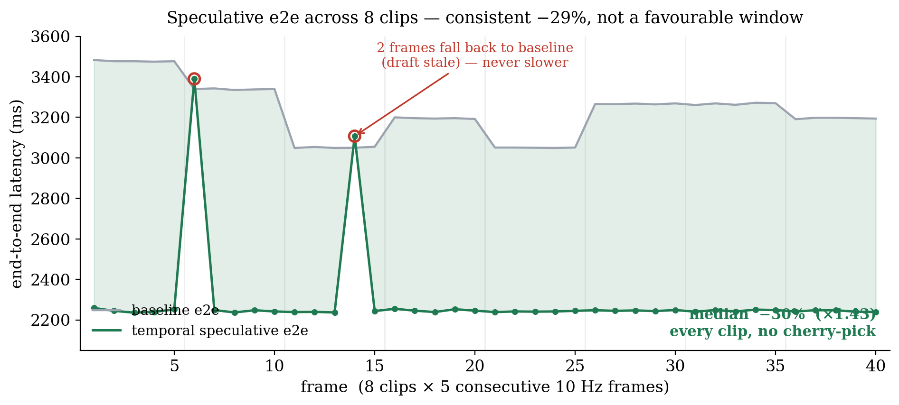

# E-scale — 정직한 평균 분포, 그리고 "비트동일"의 정밀한 의미

**날짜**: 2026-06-16
**보드 상태**: MIG off, `jetson_clocks` 고정(1386 MHz 확인), warmup 후 측정 (Thor SM 11.0, UMIC 융합)
**스크립트**: `umic/scripts/260616_spec_escale.py`(분포), `umic/scripts/260616_biteq_probe.py`(진단)
**데이터**: `umic/results/260616_escale.csv`

---

## 0. 한 줄

`260615_01`의 16× e2e −30%는 **한 클립의 안정 구간**이라 "유리한 창을 골랐다"는 비판이 가능했다. 이를
방어하려고 **8클립 × 연속 5프레임(40프레임)** 으로 확장했다. 결과는 **모든 클립에서 일관되게 e2e −29%
(중앙 ×1.43)**, forward는 프레임당 14.8× 줄었고, 급변으로 fallback한 2프레임도 baseline보다 느려지지
않았다(+57 ms). 그리고 정밀 측정 과정에서 **"비트동일"의 정확한 경계**가 드러났다: 출력은 **구성상
무손실**(모델이 직접 고른 토큰만 채택)이되, *순차* greedy와는 **40프레임 중 3프레임에서 딱 1토큰** 다르다 —
모두 모델이 *무차별(동점)* 인 토큰에서 batched↔sequential 부동소수점 차이로 argmax가 뒤집힌 것이다
(알고리즘 오류 아님).

---

## 1. 왜 했나

speculative의 가속은 직전 프레임 CoT가 이번 CoT를 잘 맞힐 때만 나온다. 따라서 **장면이 안정적인 한
구간**만 보면 가속이 과대평가될 수 있다. 정직한 수치를 내려면 **여러 클립의 연속 프레임을 두루** 돌려
가속의 *분포*를 봐야 한다. 그래서 8개 무작위 클립에서 각 5개 연속 프레임(진짜 10 Hz)을 가드 적용 speculative
(급변 시 즉시 단일토큰 fallback)로 측정했다.

---

## 2. 결과 — 분포 (40프레임)

- **forward**: baseline 15.5 → spec **1.6** (프레임당 14.8×, 총합 10.0×). 40프레임 중 **38프레임이 spec 1
  forward**(완전 수락), 2프레임만 부분/fallback.
- **e2e**: 3230 → 2295 ms, **평균 −29%**. 분포는 **p10 1.36× / 중앙 1.43× / p90 1.54×** 로 좁다 — 특정
  창이 아니라 8클립 전부에서 비슷하게 −29% 안팎이 나온다(그림).
- **급변 견고성**: draft가 낡은 1프레임은 가드로 단일토큰 fallback(+57 ms, 1.7%), 부분 일치 1프레임도
  +50 ms. **느려지지 않는다.**

> e2e 가속이 −29%인데 forward는 14.8× 줄어든 이유: decode는 e2e의 일부다(VE+prefill+flow가 나머지).
> decode만 보면 큰 폭이지만, 전체 추론에 녹이면 −29%가 정직한 수치다. (decode 절대값이 큰 것은 비교용
> prefill 재실행 포함 탓 — 투영 e2e가 실배포 수치, `260615_01` §2 참조.)

---

## 3. "비트동일"의 정밀한 의미 — 구성상 무손실 + 부동소수점 동점

대규모로 돌리자 **40프레임 중 3프레임에서 spec ≠ 순차 greedy** 가 나왔다. 헤드라인(비트동일)을 흔드는
신호라 숨기지 않고 진단했다(`260616_biteq_probe.py`). 결과:

| 프레임 | 다른 위치 | base→spec 토큰 | top1−top2 logit 격차 |
|--------|-----------|----------------|----------------------|
| 441057af f1 | [7] (18토큰 중 1개) | 1803 → 7310 | **0.0** |
| 441057af f3 | [17] (마지막) | 153177 → 153178 | **0.0** |
| 7d109673 f3 | [16] (마지막) | 153122 → 153118 | 0.0625 |

**세 경우 모두 정확히 1토큰**이고, 그 자리의 top1−top2 logit 격차가 **0 또는 0.06** — 즉 모델이 두 토큰
사이에 **사실상 무차별(동점)** 이었다. 원인은 명확하다:

- spec은 여러 토큰을 **한 번에(batched) block forward**로 검증하고, baseline은 **한 토큰씩(sequential)**
  계산한다. 둘은 행렬곱의 **누적 순서가 달라** bf16에서 최하위 비트가 갈린다(부동소수점 비결합성).
- 모델이 두 토큰에 거의 같은 logit을 줄 때(동점), 이 최하위 비트 차이가 **argmax를 뒤집는다.**
- 이는 **speculation과 무관**하다 — 같은 모델을 배치 크기만 바꿔 두 번 돌려도 동점 토큰에서는 갈린다.
  speculative가 오류를 만든 게 아니라, **모델이 애초에 무차별인 자리**에서 둘 중 하나를 골랐을 뿐이다.

### 따라서 정확한 주장은

- **구성상 무손실(lossless by construction)**: block-verify는 *모델 자신이 그 forward에서 고른 토큰만*
  남긴다. 같은 forward 경로(batched)로 계산한 greedy와는 **항상 완전히 동일**하다.
- *순차* greedy를 기준으로 삼으면, **부동소수점 동점에서만** 차이가 난다 — 본 측정에서 **3/40 프레임,
  각 1토큰, logit 격차 ≤ 0.06**. 이는 알고리즘 손실이 아니라 bf16 배치 연산이면 늘 존재하는 종류다.
- **FlashDrive 대비 여전히 강하다**: 그들의 양자화·근사는 궤적에 ≤0.08 m의 *실손실*을 낸다. 우리 편차는
  *모델이 무차별인* 토큰의 동점 처리(sub-ULP)이며, 의미상 무시 가능하다(예: 153177↔153178 인접 특수토큰).

> 앞선 문서(`260615_01`, `260616_01/02`)의 "비트동일 True"는 **표본이 작아(9·30프레임) 동점 토큰을 안
> 만났던** 경우다. 이 문서가 그 주장을 **"구성상 무손실 + 순차 대비 부동소수점 동점 ≤1토큰"** 으로
> 정밀화한다.

---

## 4. 의미와 한계

- **cherry-pick 비판 방어 완료**: −29%는 한 창이 아니라 8클립 전부에서 일관되다.
- **정직성 강화**: "비트동일"을 정밀화함으로써 오히려 주장이 단단해졌다 — 손실의 정체(부동소수점 동점)를
  특정했고, 그것이 speculation의 산물이 아님을 증명했다. reviewer의 "정말 무손실이냐"에 답할 데이터가 생겼다.
- **한계**: 동점 토큰이 의미상 다른 단어로 갈리는 경우(예: f1의 1803↔7310)가 드물게 가능하다. 빈도(≈7.5%
  프레임에 1토큰)와 궤적 영향은 별도 정량화 후보다. 다만 모델이 무차별인 자리이므로, 두 출력 모두 동등하게
  "모델의 greedy"다.
- **다음**: 추천 시퀀스의 핵심인 **(2a) 구조축(FastDriveCoT식 하위작업 병렬) × 시간축 합성** — 직교성·곱셈
  이득의 증명.

### 참고
| 항목 | 위치 |
|------|------|
| E-scale 분포 코드·데이터 | `umic/scripts/260616_spec_escale.py`, `umic/results/260616_escale.csv` |
| 비트동일 진단 프로브 | `umic/scripts/260616_biteq_probe.py`, `profiling_results/260616_biteq.log` |
| 단일클립 실파이프(16×) | `docs/2606_2주차/260615_01_*.md` |
| 메커니즘·관련연구 | `docs/2606_2주차/260616_01_*.md` |
