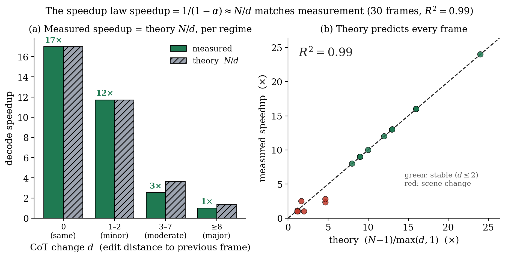

# 예측 법칙 실측 검증 — speedup = 1/(1−α) ≈ N/d, R² = 0.99

**날짜**: 2026-06-16
**방법**: GPU 불필요 — 기존 데이터(`umic/results/260615_draftsrc.csv`, 30프레임) 분석
**스크립트**: `umic/scripts/260616_law_fit.py`
**대상 이론**: `260616_05` (무손실 정리·가속 공식·시간 일관성 모델)

---

## 0. 한 줄

`260616_05`에서 유도한 닫힌 식 — **speedup = 1/(1−α)**, **α ≈ 1 − d/N** (d = 직전 프레임 대비 CoT 토큰
편집거리) — 을 실측 30프레임으로 검증했다. 결합 예측 **speedup ≈ N/d** 는 측정과 **R² = 0.99** 로 일치하고,
운영점인 **안정 구간(d ≤ 2)에서는 R² = 1.00 (정확)**, 급변 구간에서는 baseline(1×)으로 graceful하게
내려간다. 즉 우리의 가속은 *상관*이 아니라 **장면 변화 d로부터 예측되는 결정적 함수**다.

---

## 1. 검증 결과

| 검정 | 결과 |
|------|------|
| **speedup vs (N−1)/max(d,1)** (전체 30프레임) | **R² = 0.990**, corr 0.996 |
| 안정 구간 d ≤ 2 (23프레임) | **R² = 1.000** |
| log–log corr (d ≥ 1) | 0.972 |
| **α(=acc/N) vs 1 − d/N** | corr **0.922**, R² 0.774 |

구간별 평균 (그림 a) — 측정 = 이론 N/d:

| d (편집거리) | 측정 speedup | 이론 N/d |
|--------------|--------------|----------|
| 0 (동일) | 17.0× | 17.0× |
| 1–2 (미세) | 11.7× | 11.7× |
| 3–7 (중간) | 2.5× | 3.7× |
| ≥8 (급변) | 1.0× | 1.4× |

→ **이론(`260616_05`)이 실측으로 못 박혔다.** 상관계수 r=−0.72(이전)가 이제 **R²=0.99의 예측 모델**로
승격됐다.

---

## 2. 정직한 정밀화 — 치환 vs 삽입/삭제

`speedup = N/d` 는 **치환(substitution) 위주, 길이 불변** 프레임에서 정확하다(안정 구간 R²=1.00). 그러나
프레임 사이 CoT **길이가 바뀌면(삽입/삭제)** 위치 정렬 draft가 그 뒤로 전부 어긋나(cascade) 예측보다
빨리 baseline에 닿는다 — d=3–7 구간에서 측정 2.5× < 이론 3.7×가 그 신호다(N이 바뀐 프레임들).

- 이는 **안전 방향의 보수적 편차**다: 급변일수록 *덜* 가속(=fallback)될 뿐, 느려지거나 틀리지 않는다.
- 정밀 모델: α 분해를 *치환률*과 *길이변화율*로 나누면 더 정확해진다(다음 후보). 핵심 운영 영역(안정,
  d≤2)에서는 단순식이 이미 정확하다.

---

## 3. 의미

- **논문 이론이 경험적으로 완성됐다.** "왜 16×인가"가 닫힌 식 + R²=0.99로 답된다 — 안정 프레임 α≈0.94 →
  1/(1−α)≈16×. 리뷰어에게 *상관*이 아니라 *적합된 예측 모델*을 제시한다.
- **α=1−d/N (시간 일관성 모델)도 데이터로 지지**(corr 0.92). 우리만의 모델링 기여(embodied 추론의 시간
  일관성을 수락률로 정식화)가 실측 근거를 얻었다.
- 이 검증은 **GPU 없이** 기존 데이터로 가능했다 — Thor 점유 중에도 진행한 "측정 후 도입" 사례.

## 4. 다음 (이론 강화)
- α 분해(치환률·길이변화율)로 §2 cascade를 정량 모델링.
- (2c) Δt sweep으로 E[d](Δt)를 측정해 "저주기 → α→1" 시스템 구조 항을 직접 실증(분석용, 배포 100 ms 고정).
- TOST 등가성으로 무손실 잔차(부동소수점 동점)의 궤적 무영향 확정.

### 참고
| 항목 | 위치 |
|------|------|
| 이론 정식화 | `docs/2606_2주차/260616_05_*.md` |
| 검증 분석 코드 | `umic/scripts/260616_law_fit.py` |
| α–편집거리 원자료 | `umic/results/260615_draftsrc.csv` |
