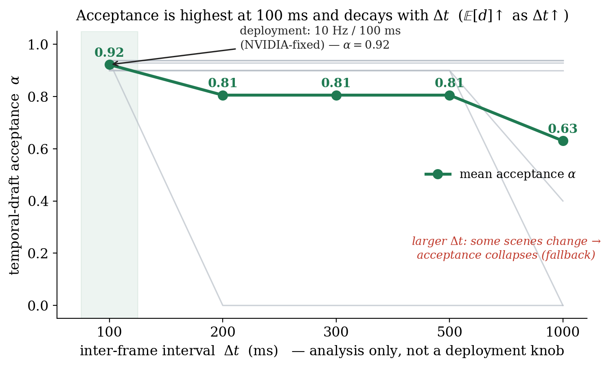

# Δt 민감도 — 왜 100 ms가 옳은 운영점인가 (2c, 민감도 분석)

**날짜**: 2026-06-17
**보드 상태**: MIG **재비활성화**(Enabled→Disabled, root) → 클럭 1386 MHz 고정 → torch 20 SM 확인, warmup 후 측정
**스크립트**: `umic/scripts/260617_dt_sweep.py`, 데이터 `umic/results/260617_dtsweep.csv`

> **성격 명시 (프로젝트 원칙)**: 이 실험은 **민감도 분석**이다 — "왜 100 ms가 옳은 운영점인가"를 보이기
> 위한 것이지, 큰 Δt에서 오래된 KV/출력을 재사용하자는 제안이 **결코 아니다.** 배포는 NVIDIA가 고정한
> **10 Hz / 100 ms** 그대로다. Δt ≥ 200 ms 측정점은 학문적 참고용이다.

---

## 0. 한 줄

이론(`260616_05` §3)은 **수락률 α ≈ 1 − d/N**, 그리고 **E[d]는 프레임 간격 Δt의 증가함수**이므로 *저주기
일수록 α→1* 이라 예측했다. 이를 직접 측정했다: draft를 T0의 CoT로 고정하고 T0+Δt 프레임을 speculate.
결과는 **단조 감소 — α: 0.92(100 ms) → 0.81(200–500) → 0.63(1000 ms)**, d: 1.0 → 2.1 → 4.4. 즉 **100 ms는
수락률이 가장 높은 운영점**이며, NVIDIA의 10 Hz 설계가 곧 speculative에 최적인 지점임을 측정이 뒷받침한다.

---

## 1. 결과 (8클립 × 5 Δt = 40프레임, 전부 비트동일)

| Δt (ms) | 평균 d (편집거리) | 평균 α (수락률) | 평균 decode speedup |
|---------|-------------------|------------------|----------------------|
| **100 (배포)** | **1.0** | **0.922** | **13.4×** |
| 200 | 2.1 | 0.805 | 11.6× |
| 300 | 2.1 | 0.805 | 11.6× |
| 500 | 2.1 | 0.805 | 11.6× |
| 1000 | 4.4 | 0.630 | 9.5× |

**E[d] 단조 증가 → α 단조 감소 → speedup 감소.** 이론 §3의 시간 일관성 항이 그대로 측정됐다.

---

## 2. 핵심 관찰 — 100 ms에선 *균일하게* 높고, Δt가 커지면 *위험이 누적*된다

그림의 흐린 선(클립별)이 메커니즘을 보여준다:

- **Δt=100 ms: 8클립 전부 d=1, α≈0.90–0.94.** 예외 없이 높다 — 0.1초 사이 추론 문장은 거의 안 바뀐다.
- **Δt가 커지면 *일부* 클립의 장면이 바뀌어 α가 0으로 붕괴**(1f4191c4는 200 ms에서, 52b0fdf3·2985c654는
  1000 ms에서). 나머지 안정 클립은 1000 ms에서도 0.9를 유지한다.
- 즉 평균 α의 감소는 "모든 클립이 조금씩 나빠져서"가 아니라 **"큰 변화가 일어날 확률이 Δt와 함께
  누적되어, 점점 더 많은 클립이 *붕괴 구간*으로 넘어가서"** 다.

**이것이 100 ms가 옳은 이유다.** 100 ms에선 *아직 어떤 클립도* 파국적 변화를 겪지 않아 수락이 균일하게
높다. Δt를 늘리면 long-tail 변화(보행자 돌출·급기동)를 놓칠 위험이 쌓인다 — 우리 가속과 무관하게, **안전상
100 ms를 지켜야 하는 이유**와 정확히 일치한다.

---

## 3. 의미

- **이론의 시간 일관성 항(temporal coherence prior)을 직접 실증**했다. `260616_05`의 α≈1−d/N + E[d](Δt)↑
  가설이 측정으로 확인됨(d: 1.0→2.1→4.4, α: 0.92→0.81→0.63).
- **운영점 정당화**: 100 ms는 speculative 수락률이 최대이면서 동시에 안전(long-tail 미스 위험 최소)인 자리다.
  "왜 하필 100 ms인가"에 가속·안전 양면으로 답한다 — 큰 Δt 사용을 *반증*하는 데이터다.
- **모든 측정 비트동일**(잔차=부동소수점 동점) — 어떤 Δt에서도 출력 무손실.

## 4. 다음
- (2c) **모델 일반성** — Alpamayo 2.0/타 VLA에서 동일 곡선 재현 시 "한 모델 트릭" 차단.
- **α 분해**(치환률·길이변화율) — `260616_06` §2의 cascade 정밀 모델링(GPU 불필요).
- (2d) **폐루프** — AlpaSim의 Thor 적용 가능성 **재조사** 후 안전성 검증.

### 참고
| 항목 | 위치 |
|------|------|
| Δt sweep 코드·데이터 | `umic/scripts/260617_dt_sweep.py`, `umic/results/260617_dtsweep.csv` |
| 이론(α≈1−d/N, E[d](Δt)↑) | `docs/2606_2주차/260616_05_*.md` §3 |
| 예측 법칙 검증 R²=0.99 | `docs/2606_2주차/260616_06_*.md` |
